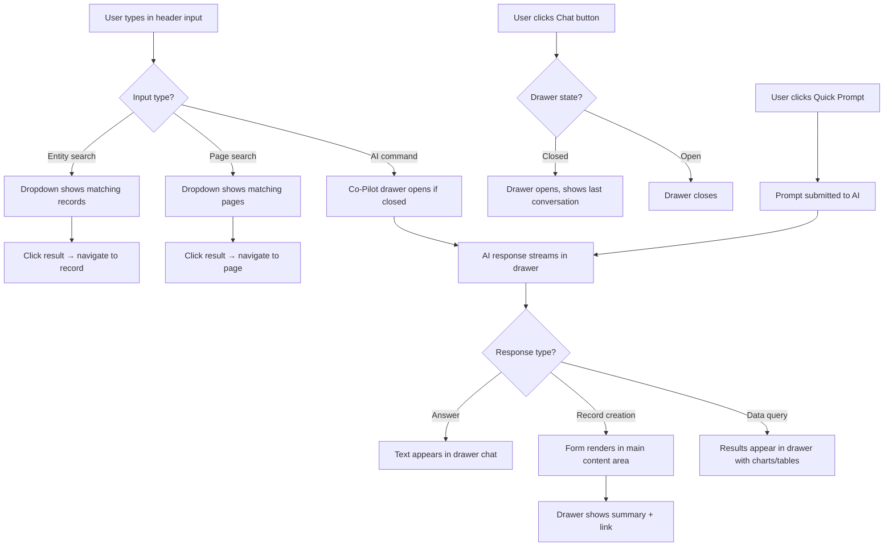
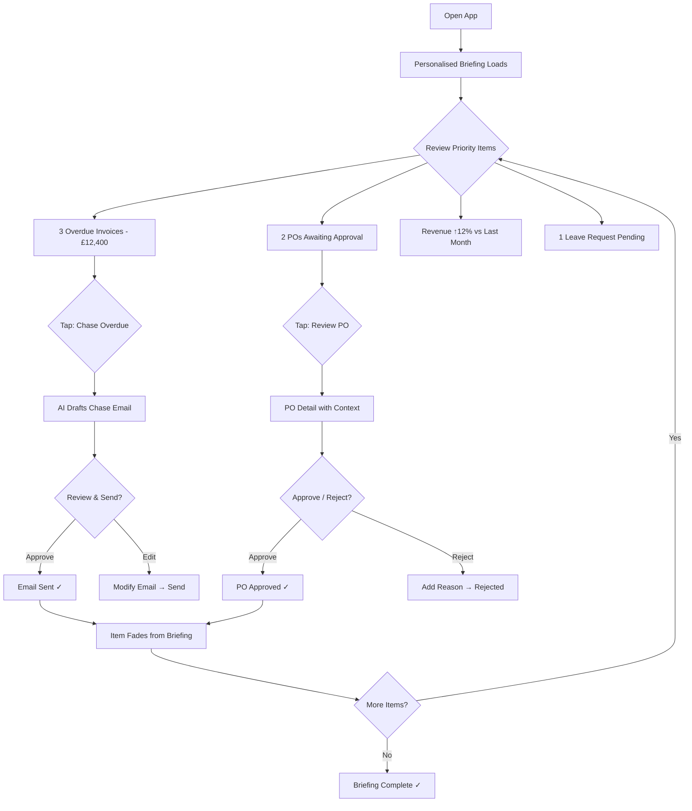
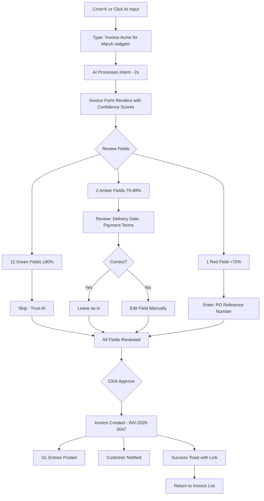
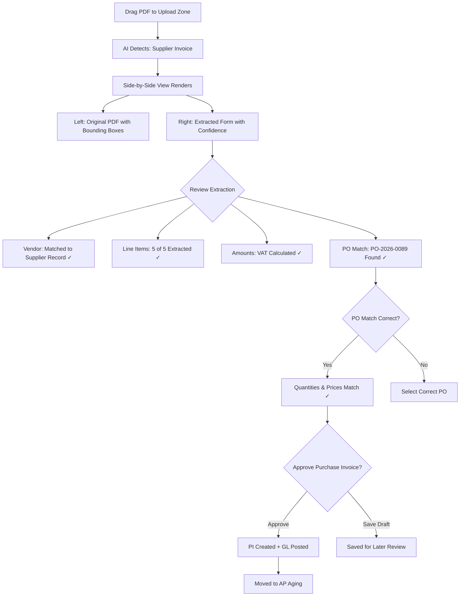
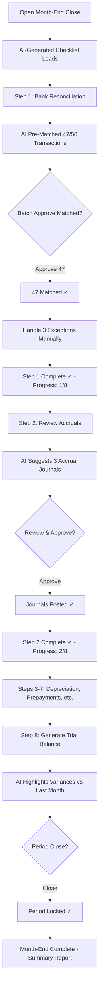
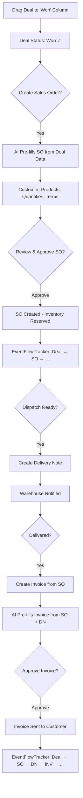

# UX Design Specification — Nexa ERP

**Author:** Mohammed
**Date:** 16 February 2026

---

## Executive Summary

### Project Vision

Nexa ERP inverts the traditional ERP interaction model. Instead of users learning the system, the system learns the user. The core differentiator is the **"Told, Shown, Approve, Done"** paradigm — users state intent in natural language, the AI pre-fills complete records using business context (customer history, default terms, seasonal patterns), the user reviews and approves, and the record is committed. No major ERP vendor has shipped an AI-first interaction paradigm; competitors (SAP, Oracle, Sage, Xero, Odoo, Zoho) have only added AI as sidebar features while keeping form-driven workflows unchanged.

The UX embodies this philosophy across every screen: AI as the primary interaction path, traditional forms as the always-available fallback — both paths using the same API and data layer. The purple theme (from prototypes D/E/F) establishes the visual identity. **Concept D: Co-Pilot Dock** has been chosen as the AI interaction model — a collapsible drawer on the right side of the screen that provides contextual AI assistance, chat history, and preset prompts.

**Target market:** UK SMEs (10–250 employees) currently on legacy desktop ERPs (HansaWorld, Sage, custom systems). SaaS B2B, database-per-tenant, greenfield codebase. Tech stack: TypeScript, React 19, Tailwind CSS 4, Shadcn UI, Fastify, PostgreSQL, Prisma ORM, Claude API.

### Target Users

Eight personas spanning phone, tablet, and desktop — each starting their day with a role-based AI briefing:

| Persona | Role | Device | Primary Pain Point | Key UX Need |
|---------|------|--------|--------------------|-------------|
| **Sarah** | Business Owner (45-person manufacturing) | Phone | 2-hour morning slog across 15+ screens | 15-min briefing with one-tap actions, period comparisons |
| **David** | Finance Manager | Desktop | 3-day month-end, manual bank matching, 200 invoices/month | AI document extraction, batch approval, month-end checklist |
| **Priya** | Sales/CRM Manager | Desktop | CRM disconnected from Sales Orders | Pipeline-to-invoice lifecycle without module switching |
| **Marcus** | Warehouse/Production Manager | Tablet | 4 phone calls + 3 spreadsheets for coordination | Real-time stock, barcode scanning, production scheduling |
| **Fatima** | HR Manager | Desktop | 2-day payroll, manual compliance tracking | AI payroll prep, proactive compliance alerts |
| **Tom** | System Admin | Desktop | Complex setup, 15 users to manage | Single console, 30 min/week admin target |
| **Claire** | External Accountant (Phase 2) | Desktop | VPN/physical access needed for financials | Scoped read access + journal posting |
| **New User** | Any first-time user | Any | ERPs take months to learn | "Magic Moment" in under 5 minutes |

**Cross-persona UX patterns:** Every persona starts with a role-based daily briefing, follows "AI prepares, human approves", needs cross-module awareness (no siloed views), and can always drop to traditional forms.

### Key Design Challenges

1. **The Form Complexity Problem** — Legacy HansaWorld has 313-field customer forms, 211-field item forms, 280-field invoices. Nexa must handle this breadth through progressive disclosure and tabbed layouts while keeping the AI path effortlessly simple. 18 different Header+Lines form types (invoices, orders, POs, journals, etc.) share a common pattern that must be designed once and reused everywhere.

2. **Status + Events + Notifications at Scale** — 37 entity state machines, 97 business events, 7 cross-module flow chains (Order-to-Cash, Procure-to-Pay, Document-to-Pay, Payroll, Month-End Close, Manufacturing, Lead-to-Customer). Status must be displayed consistently across all entities using a semantic colour system. Notifications must be tiered (immediate toast vs. notification centre vs. audit-only) and actionable (inline approve/reject buttons). A generic `<StatusBadge>`, `<StatusTimeline>`, `<NotificationCentre>`, `<RealtimeIndicator>`, and `<EventFlowTracker>` component set is required.

3. **Dashboard Philosophy** — Dashboards must show period comparisons, not single numbers. The PRD defines role-based daily briefings that are contextual, personalised, actionable, and cross-module — this replaces the traditional static dashboard. Every KPI must show delta/trend (e.g., "Revenue £142K ↑12% vs last month"), not bare numbers.

4. **Responsive Strategy** — Sarah uses phone, Marcus uses tablet, others use desktop. No mobile-first FR/NFR exists yet (validation gap). The UX must define breakpoints (375px+), touch targets (44x44px minimum), and mobile-specific navigation patterns.

5. **AI Confidence & Trust** — AI pre-fills must show confidence scoring (>=90% green/auto-suggest, 70–89% amber/review, <70% red/manual). Document Understanding needs side-by-side original document view with bounding boxes alongside extracted data. Users need to always know what the AI "did" and "why."

6. **Approval UX at Every Level** — Financial AI actions NEVER execute without user approval (NFR16). PO approvals are multi-level with configurable thresholds. Bank feed matching needs batch approval. Leave requests, journals, and payroll all have approval workflows. The system needs a unified approval UX pattern: one-tap approve, batch approve, multi-level routing display.

### Design Opportunities

1. **"The Briefing" as the Home Screen** — Replace the traditional dashboard with a personalised AI briefing that is the first thing every user sees. Each item is actionable (one-tap chase, approve, review). This is Nexa's signature UX moment — no competitor does this.

2. **Cross-Module Event Flow Visualisation** — Show users the full lifecycle of their business processes (Quote → Order → Dispatch → Invoice → Payment) in a horizontal process tracker. Real-time status updates as downstream entities are created. This gives ERP users something they've never had: visibility into where a transaction sits across the entire business.

3. **Document Understanding as the AI "Wow Moment"** — Upload a supplier invoice (web, camera, or email), AI extracts all fields with confidence scores, matches to PO, presents for one-click approval. This turns 45 minutes of data entry into 3 minutes of review.

4. **Generic Status System** — A data-driven status configuration that maps any entity's status enum to semantic categories (Initial, InProgress, AwaitingAction, Success, Partial, Cancelled, Error, Warning, Terminal) with consistent colours, icons, and animations. Adding a new entity type requires only a config entry, no component changes.

5. **Saved Views as a Power Feature** — Users can save personalised views (columns, filters, sorting) per entity type, star favourites, and AI can create views from natural language ("show me overdue invoices sorted by amount"). This bridges the gap between the AI path and the traditional path.

## Core User Experience

### Defining Experience

The **core interaction loop** for every Nexa user is **"Told, Shown, Approve, Done"**:

1. **Told** — The user states intent in natural language: *"Create an invoice for Acme Ltd for the March widget order"*
2. **Shown** — The AI pre-fills the complete record using business context (customer terms, order history, default VAT rates, seasonal pricing) and presents it in the standard form layout with confidence indicators on each field
3. **Approve** — The user reviews, adjusts any flagged fields, and taps Approve
4. **Done** — The record is committed, downstream events fire (stock reserved, GL entries posted, notification sent), and the user sees confirmation with a link to the created entity

This loop applies universally: invoices, purchase orders, journal entries, leave requests, production orders, customer records, and every other entity. The AI path and the traditional form path produce identical records through the same API — the difference is who fills in the fields.

**The single most frequent action** is reviewing and approving AI-prepared records. Users spend more time *validating* than *typing*. This inverts the traditional ERP time profile from 80% data entry / 20% review to 20% intent expression / 80% business decision-making.

**Secondary core actions** (in frequency order):
- Morning briefing review with one-tap actions (daily, all personas)
- List browsing with AI-powered filtering and saved views (hourly, all personas)
- Document upload and AI extraction review (daily, Finance/AP)
- Batch approval of matched transactions (daily, Finance)
- Status checking across cross-module flows (hourly, Sales/Warehouse)

### Platform Strategy

| Dimension | Decision | Rationale |
|-----------|----------|-----------|
| **Primary platform** | Web SPA (responsive) | UK SME users on varied devices; no app store friction |
| **Desktop** (1024px+) | Full experience: sidebar nav, split panels, AI dock | David, Priya, Fatima, Tom, Claire — primary work device |
| **Tablet** (768–1023px) | Touch-optimised: collapsible sidebar, larger touch targets (48x48px), barcode scanning | Marcus in warehouse — needs one-handed operation |
| **Phone** (375–767px) | Briefing-first: AI briefing as home, stacked layouts, bottom tab nav, swipe gestures | Sarah on commute — review and approve, not create |
| **Offline** | Not required for MVP | SaaS model, always-connected UK SME offices |
| **Framework** | React 19 + Vite 6 + Tailwind CSS 4 + Shadcn UI | Architecture decision — component library with Radix primitives |
| **Real-time** | Server-Sent Events (SSE) per tenant | Status changes, notifications, collaborative awareness |
| **AI integration** | Claude API via backend proxy | No direct client-to-AI calls; streaming responses via SSE |

**Breakpoint system:**
- `sm`: 375px — Phone (portrait)
- `md`: 768px — Tablet / Phone (landscape)
- `lg`: 1024px — Small desktop / Tablet (landscape)
- `xl`: 1280px — Desktop
- `2xl`: 1536px — Large desktop

**Touch target minimums:** 44x44px on phone, 48x48px on tablet (exceeds WCAG 2.5.8 minimum of 24x24px).

### Effortless Interactions

These interactions must feel **zero-effort** — the user's cognitive load should be near zero:

1. **Morning Briefing** — User opens Nexa, sees personalised role-based briefing immediately. No navigation, no clicking through to dashboards. Sarah sees "3 overdue invoices (£12,400), 2 POs awaiting approval, revenue ↑12% vs last month" with one-tap actions for each item.

2. **AI Record Creation** — User types natural language intent, AI returns a fully-formed record. The user's job is to review green-highlighted confident fields (>=90%), inspect amber fields (70–89%), and fill only red fields (<70%). For a returning customer's standard order, this means reviewing a complete invoice with zero manual field entry.

3. **Document Understanding** — User uploads/photographs/emails a supplier invoice. AI extracts vendor, line items, amounts, dates, VAT. Matches to existing PO. Presents side-by-side: original document (with bounding boxes) on left, extracted form on right. One-click approve if all fields are green.

4. **Batch Operations** — Bank feed matching: AI matches 47/50 transactions, user reviews batch, taps "Approve All Matched", manually handles 3 exceptions. Same pattern for payroll review, month-end journal batches, and bulk status updates.

5. **Cross-Module Navigation** — From an invoice, one click to the originating sales order, the customer record, the delivery note, the GL entries, or the payment. No module switching, no re-searching. The `<EventFlowTracker>` component shows the full lifecycle horizontally.

6. **Saved Views** — User asks AI "show me overdue invoices over £1,000 sorted by amount" and gets a filtered, sorted list instantly. Save it as a named view. Star it as a favourite. It appears in their sidebar navigation.

### Critical Success Moments

These are the make-or-break moments that determine whether Nexa succeeds or fails:

| Moment | Persona | What Must Happen | Failure Mode |
|--------|---------|------------------|--------------|
| **First Briefing** | New User | Within 5 minutes of first login, user sees a personalised briefing with real data and thinks "this knows my business" | Generic/empty dashboard, no sense of intelligence |
| **First AI Invoice** | David | User says "invoice Acme for March widgets", gets back a complete invoice with correct terms, VAT, line items — reviews and approves in under 60 seconds | Wrong customer terms, missing line items, requires >50% manual correction |
| **First Document Upload** | David | User uploads a supplier PDF, sees extracted data appear field-by-field with confidence indicators, matches to PO automatically | Extraction fails, no PO match, user must re-type everything |
| **Morning Routine** | Sarah | 15-minute phone review replaces 2-hour desktop slog. Every briefing item has a one-tap action. Period comparisons show business trajectory. | Briefing is just a notification list, no actions, no comparisons |
| **Month-End Close** | David | AI-prepared checklist with pre-matched bank feeds, suggested accruals, and batch approval. 3-day process becomes 1 day. | Still requires manual matching, no checklist, same 3 days |
| **Stock Check** | Marcus | Scan barcode on tablet, see real-time stock across all locations, with incoming PO and allocated SO quantities. Under 3 seconds. | Slow response, stale data, no cross-location visibility |
| **System Setup** | Tom | Initial company setup wizard: 10 guided steps, AI suggests chart of accounts from industry template, imports opening balances. Under 2 hours. | 50-page manual, 3-day setup, requires consultant |

### Experience Principles

Five principles that guide every UX decision in Nexa ERP:

1. **AI Prepares, Human Decides** — The AI's job is to eliminate data entry, not decision-making. Every AI action produces a reviewable proposal, never a committed fact. Financial actions NEVER execute without explicit user approval (NFR16). The user is always the authority; the AI is always the assistant.

2. **Show the Delta, Not the Number** — Every metric, KPI, and status must show change over time: vs. last period, vs. budget, vs. target. "Revenue £142K" is meaningless; "Revenue £142K ↑12% vs last month" tells a story. This applies to the briefing, dashboards, report summaries, and inline entity metrics.

3. **One Entity, Full Context** — When a user is looking at any record, they can see its full lifecycle (order → dispatch → invoice → payment), its related entities (customer, items, GL entries), and its current status — without navigating away. Cross-module awareness is built into every detail view through the `<EventFlowTracker>` and related-entity panels.

4. **Progressive Disclosure, Never Hiding** — Complex forms (313-field customer, 280-field invoice) use tabbed layouts with the most-used fields on the primary tab and specialised fields on secondary tabs. Nothing is hidden or removed — power users can always reach every field. The AI path shows only the fields that matter for this specific record; the form path shows the full layout. Both are always one click apart.

5. **Consistent Status Language** — All 37 entity state machines use the same 9 semantic categories (Initial → InProgress → AwaitingAction → Success → Partial → Cancelled → Error → Warning → Terminal) with consistent colours, icons, and animations. A user who understands invoice status immediately understands PO status, leave request status, and production order status. The `<StatusBadge>` component is the single source of truth.

## Desired Emotional Response

### Primary Emotional Goals

Three emotional states define the Nexa experience, in priority order:

1. **Empowered Clarity** — *"I understand my business better than I ever have."* Users should feel that Nexa gives them insight they couldn't get before — not through complexity, but through intelligent presentation. Period comparisons, cross-module flows, and the AI briefing combine to create a feeling of command. Sarah on her phone at 7am should feel like a CEO with a personal analyst, not a user battling an ERP.

2. **Effortless Competence** — *"I can do this without thinking about the software."* The system should feel invisible. Users should think about their business decisions (should I approve this PO?), not about the software mechanics (which menu, which tab, which field?). A new user should feel competent within 5 minutes. A legacy HansaWorld user should feel liberated within their first session.

3. **Trustworthy Partnership** — *"The AI is helping me, and I can verify everything it does."* Users must never feel that the AI is a black box or that it might act without their knowledge. Confidence scores, explainable suggestions ("Based on Acme's last 12 orders..."), and the absolute rule that nothing commits without approval — these create a partnership feeling, not an automation anxiety.

### Emotional Journey Mapping

| Stage | Target Emotion | Design Mechanism | Anti-Pattern to Avoid |
|-------|---------------|------------------|----------------------|
| **First Visit** | Curiosity → Quick Delight | Setup wizard with AI suggestions, "Magic Moment" in <5 min, first briefing with real data | Empty screens, long setup, "configure everything first" |
| **Morning Briefing** | Calm Control | Personalised, prioritised, actionable items with period comparisons. No alarms, no chaos — curated intelligence | Notification overload, red badges everywhere, anxiety-inducing urgency |
| **AI Record Creation** | Pleased Surprise | Pre-filled form appears with correct data, user thinks "it got it right" | Wrong data requiring extensive correction, breaking trust |
| **Document Upload** | "Wow" → Satisfied Trust | Watch fields populate in real-time from uploaded document, confidence indicators build trust | Slow extraction, errors, no feedback during processing |
| **Approval Flow** | Confident Authority | Clear what they're approving, why it's needed, one-tap action with undo available | Unclear consequences, no context, buried in workflow |
| **Error / Exception** | Guided Resolution | AI explains what went wrong, suggests fix, never a dead end. Tone is helpful, not alarming | Red error banners, cryptic codes, blame the user |
| **Month-End Close** | Progressive Accomplishment | Checklist with progress bar, each completed step gives small satisfaction, AI handles the tedious parts | Endless manual reconciliation, no sense of progress |
| **Return Visit** | Familiar Welcome | Remembered preferences, picked up where they left off, briefing reflects what changed since last visit | Starting from scratch, no continuity, generic home screen |

### Micro-Emotions

**Must cultivate:**

- **Confidence** over Confusion — Every screen answers "what am I looking at?" and "what should I do next?" within 2 seconds. Status badges, breadcrumbs, and contextual headers eliminate orientation anxiety.
- **Trust** over Scepticism — AI confidence scores (green/amber/red), "AI suggested because..." tooltips, and the immutable rule that AI never commits without approval. Trust is earned field-by-field, not assumed.
- **Accomplishment** over Frustration — Micro-celebrations: a subtle checkmark animation when an invoice is approved, a progress increment on the month-end checklist, a "you're up to date" state on the briefing. Small wins compound into satisfaction.
- **Delight** over Mere Satisfaction — Occasional "wow" moments: AI correctly pre-filling a complex 15-line invoice, document extraction nailing every field, a saved view that perfectly captures what the user needed. These moments create advocacy.

**Must prevent:**

- **Overwhelm** — Progressive disclosure on forms, tiered notifications (not everything is urgent), collapsible sidebar sections. The system must feel spacious, not dense.
- **Anxiety** — No aggressive red indicators for non-critical items. Financial errors are serious; a missing optional field is not. The colour system must distinguish severity honestly.
- **Abandonment** — No dead-end screens. Every error state has a next action. Every empty state has guidance. Every loading state has feedback. Users should never feel stranded.
- **Surveillance** — Audit trails exist but aren't visible as "tracking." The AI assistant is a helper, not a monitor. Activity logging serves the business, not management oversight.

### Design Implications

| Emotional Goal | UX Design Choice |
|---------------|-----------------|
| Empowered Clarity | Period comparison on EVERY metric (↑12% vs last month). Cross-module `<EventFlowTracker>` on every detail view. Role-based briefing as home screen — not a generic dashboard. |
| Effortless Competence | AI as primary path (natural language input always available). Progressive disclosure (primary tab shows 15 fields, not 280). Keyboard shortcuts for power users. Consistent patterns across all 11 modules. |
| Trustworthy Partnership | Confidence indicators on every AI-filled field. "AI suggested because..." expandable explanations. Side-by-side document view (original + extracted). Undo available for 30 seconds after approval. |
| Calm Control (Briefing) | Muted purple palette — not aggressive. Information density that informs without overwhelming. Items sorted by business priority, not chronological. Completed items fade, don't disappear. |
| Pleased Surprise (AI) | Streaming AI responses (watch fields fill in). Smooth animations on state transitions. Success states that feel rewarding (subtle glow, checkmark). |
| Guided Resolution (Errors) | Warm amber for warnings, reserved red only for blocking errors. Every error message includes a suggested action. Inline validation on form fields (don't wait for submit). Toast notifications auto-dismiss; errors persist until resolved. |
| Progressive Accomplishment | Month-end checklist with step counter and progress bar. Batch approval counter ("47 of 50 matched"). Briefing items that can be crossed off. Daily summary of what was accomplished. |

### Emotional Design Principles

1. **Calm Over Urgent** — The default emotional register is calm professionalism. Urgency is reserved for genuinely time-sensitive items (overdue payments, failed payroll runs, compliance deadlines). Most ERP notifications are informational, not urgent — the UX must reflect this through the 3-tier notification system (Tier 1: toast + centre for critical, Tier 2: centre only for standard, Tier 3: audit-only for routine).

2. **Earned Trust, Not Assumed Trust** — The AI starts every interaction by showing its work. Confidence scores are visible. Suggestions include reasoning. As users verify AI accuracy over time, trust compounds naturally. We never ask users to "just trust the AI" — we show them evidence and let trust emerge.

3. **Small Wins Compound** — Every completed action gets acknowledged: a subtle animation, a counter increment, a status change. These micro-celebrations are brief (200–400ms) and tasteful (not confetti) — but they create a rhythm of accomplishment that makes ERP work feel productive rather than administrative.

4. **Space to Think** — Generous whitespace in the purple theme, clear visual hierarchy, and progressive disclosure all serve the same purpose: giving the user's brain space to focus on the business decision, not the interface. The most important information has the most visual weight; everything else recedes.

5. **Recovery is Part of the Experience** — Errors, mistakes, and exceptions are normal business events, not failures. The UX treats them as part of the workflow: an AI extraction confidence of 45% is not an error — it's an invitation for the user to provide the correct value. An unmatched bank transaction is not a problem — it's an opportunity for the user to teach the system. The emotional tone of exceptions is "let's sort this out together."

## UX Pattern Analysis & Inspiration

### Inspiring Products Analysis

**1. Linear (Project Management)**
Linear is the gold standard for "AI-meets-productivity" in B2B SaaS. Its relevance to Nexa:
- **Command palette (Cmd+K)** — Universal access to any action without navigating menus. Type "create issue" or "assign to me" and it just works. This directly maps to Nexa's AI command entry point.
- **Keyboard-first, mouse-friendly** — Power users never touch the mouse; new users click through comfortably. Both paths reach the same outcome. This mirrors Nexa's "AI path + form path = same result" philosophy.
- **Status as a first-class citizen** — Issues have clear, coloured status indicators visible in every view (list, board, detail). Status transitions are one-click. This is exactly what Nexa needs for its 37 state machines.
- **Minimal chrome, maximum content** — Sidebar collapses, toolbars are contextual, the workspace feels spacious. Supports our "Space to Think" emotional principle.
- **Real-time without noise** — Changes from teammates appear live without disrupting focus. Status updates flow in via subtle indicators, not pop-ups.

**2. Stripe Dashboard (Financial SaaS)**
Stripe's dashboard is the benchmark for financial data presentation:
- **Period comparisons everywhere** — Every metric shows "vs. previous period" with a trend indicator. Revenue isn't "£142K" — it's "£142K ↑12.3%". This is exactly Mohammed's requirement: never a single number, always a comparison.
- **Progressive detail** — Summary cards → click to see breakdown → click to see individual transactions. Three levels of depth, always one click apart. Maps perfectly to Nexa's dashboard → list → detail flow.
- **Batch operations done right** — Stripe's payout and refund batch flows: select items, review batch, confirm. Clean, confident, with clear counts ("3 of 47 selected"). Template for Nexa's batch approval patterns.
- **Document-quality data tables** — Column sorting, filtering, date ranges, export — all inline, no modal popups. Saved filters persist. This informs Nexa's entity list views.
- **Webhook/event visibility** — Stripe shows event logs with payloads, retry status, and failure reasons. Directly relevant to Nexa's event catalog visibility needs.

**3. Notion (Collaborative Workspace)**
Notion demonstrates how AI can be integrated into a content-creation workflow:
- **AI as inline assistant** — Type `/ai` to get AI help within the current context. The AI operates within the document, not in a separate panel. Relevant to Nexa's AI record creation where the AI fills fields in the form itself.
- **Views on the same data** — Table, board, calendar, gallery — all showing the same underlying data with different presentations. This maps to Nexa's saved views concept where the same entity list can be viewed as a table, filtered view, or board (for CRM/kanban).
- **Template system** — Pre-built templates that set up structure instantly. Parallels Nexa's AI suggesting record templates based on customer history.
- **Breadcrumb navigation** — Always know where you are in the hierarchy. Essential for Nexa's module → entity → record navigation.

**4. Xero (Accounting SaaS — Direct Competitor)**
Xero is the closest product category to Nexa and represents what to learn from *and* surpass:
- **Bank reconciliation flow** — Side-by-side: bank statement line on left, suggested match on right, approve/create/transfer buttons below. Clean, focused, fast. This is the template for Nexa's bank feed matching — but Nexa adds AI confidence scoring and batch approval.
- **Dashboard with watchlist** — Customisable account watchlist on the dashboard. Simple but useful. Nexa's briefing goes far beyond this with AI-curated, role-based, actionable items.
- **Invoice creation flow** — Clean form with customer auto-complete, line item entry, tax calculation. Competent but entirely manual. This is precisely what Nexa replaces with "tell the AI what you want, review the result."
- **What Xero lacks** — No AI assistance, no cross-module visibility (can't see a sales pipeline from an invoice), no period comparisons on the dashboard (single numbers only), no document understanding, no natural language interaction. Every gap is a Nexa opportunity.

### Transferable UX Patterns

**Navigation Patterns:**
| Pattern | Source | Nexa Application |
|---------|--------|-----------------|
| Command palette (Cmd+K) | Linear | Universal AI entry point — type natural language commands from anywhere |
| Collapsible sidebar with module grouping | Linear, Notion | Module-based navigation with collapse for focus; starred/pinned items at top |
| Breadcrumb trail | Notion, Xero | Module → Entity Type → Record navigation; click any level to jump back |
| Contextual toolbar | Linear | Form actions (save, approve, delete) appear only when relevant |

**Data Display Patterns:**
| Pattern | Source | Nexa Application |
|---------|--------|-----------------|
| Period comparison on every metric | Stripe | Briefing KPIs, dashboard cards, report summaries — always show delta |
| Progressive detail (summary → list → detail) | Stripe | Dashboard cards click through to filtered lists, then to record detail |
| Inline batch operations | Stripe | Bank feed matching, payroll approval, bulk status updates |
| Multiple views on same data | Notion | Entity lists as table (default), board (CRM pipeline), or calendar (HR leave) |
| Real-time status indicators | Linear | SSE-powered status badges that update without page refresh |

**AI Integration Patterns:**
| Pattern | Source | Nexa Application |
|---------|--------|-----------------|
| AI as inline assistant | Notion | AI fills form fields in-place, not in a separate chat panel |
| Confidence indicators | Medical/ML UIs | Green (>=90%), amber (70–89%), red (<70%) on every AI-filled field |
| Streaming responses | ChatGPT/Claude | Watch AI fill fields progressively — builds trust and feels responsive |
| Suggestion with reasoning | GitHub Copilot | "AI suggested because Acme's last 3 orders used Net 30 terms" |

**Form & Input Patterns:**
| Pattern | Source | Nexa Application |
|---------|--------|-----------------|
| Tabbed form with primary/secondary | Xero, Sage | Primary tab: 15 most-used fields. Tabs 2–5: specialised fields. All 280 fields accessible |
| Header + Lines pattern | Every accounting app | Shared component for invoices, POs, journals, credit notes — 18 variants of one pattern |
| Inline validation | Stripe | Field-level validation on blur, not on submit. Errors appear next to the field |
| Auto-save draft | Notion, Google Docs | Records auto-save as DRAFT, explicit action to post/approve |

### Anti-Patterns to Avoid

1. **The SAP Trap: Screens of Screens** — SAP's UI requires navigating 4–7 screens to complete a single transaction. Each screen is a modal or new page with no back-context. Nexa must NEVER require more than 3 clicks to reach any record, and cross-module navigation must be inline (side panels, linked badges), not new pages.

2. **The Sage Trap: Feature Menus as Navigation** — Sage organises navigation by feature ("Bank Reconciliation," "VAT Return," "Fixed Assets") rather than by workflow. Users must know the feature name to find it. Nexa organises by module (Finance, Sales, HR) with AI as the escape hatch — "I need to reconcile the bank" works even if you don't know it's under Finance → Bank Feeds.

3. **The Dashboard Number Wall** — Most ERP dashboards show 20+ single-value KPIs in a grid: "Revenue: £142K", "Invoices: 47", "Overdue: 12". No context, no comparison, no actionability. Nexa replaces this entirely with The Briefing — every number has a comparison, every item has an action.

4. **The Chatbot Sidebar** — Competitors adding AI as a chat sidebar (Salesforce Einstein, Zoho Zia) create a disconnected experience. The user chats with the AI in one panel and works in forms in another. Nexa's AI operates *within* the form — it fills the same fields the user would, it pre-populates the same layout, it's not a separate conversation.

5. **The Notification Firehose** — ERPs that treat every event as equally urgent: "Invoice created," "Payment received," "User logged in" — all in the same notification stream. Nexa's 3-tier system (toast for critical, centre for standard, audit-only for routine) prevents notification fatigue.

6. **The Wizard Trap** — Multi-step wizards that prevent editing earlier steps or seeing the full picture. Nexa's AI path shows the complete record at once (not step-by-step) with confidence indicators. The traditional form path uses tabs (visible, clickable, non-linear), not wizard steps.

### Design Inspiration Strategy

**Adopt Directly:**
- Linear's command palette as Nexa's universal AI entry point (Cmd+K / Ctrl+K)
- Stripe's period comparison pattern for every metric in the briefing and dashboards
- Stripe's batch operation flow for bank feed matching, payroll, and bulk approvals
- Linear's coloured status badges as the foundation for `<StatusBadge>`
- Notion's breadcrumb navigation for module → entity → record hierarchy

**Adapt for Nexa:**
- Notion's AI inline assistance → Nexa's AI fills form fields with confidence scoring (no competitor does this)
- Stripe's progressive detail → Nexa's Briefing → List → Detail flow with cross-module event tracking (goes beyond Stripe)
- Xero's bank reconciliation → Nexa adds AI matching, confidence scores, and batch approval (upgrades Xero's pattern)
- Linear's real-time updates → Nexa's SSE-powered status system across 37 state machines (larger scale than Linear)

**Reject Explicitly:**
- SAP's screen-of-screens navigation → single-page app with inline panels
- Sage's feature-based menus → module-based + AI search
- Competitor chatbot sidebars → AI within the form, not beside it
- Dashboard number walls → Briefing with comparisons and actions
- Notification firehose → 3-tier system with business-priority sorting

## Design System Foundation

### Design System Choice

**Shadcn UI + Tailwind CSS 4 + Radix Primitives** — a themeable component system with full control.

This is a **Category 3: Themeable System** approach, but closer to custom than most themeable systems because Shadcn UI copies components into your codebase (not a locked npm dependency). You own every line of component code, can modify anything, and still benefit from Radix's accessibility primitives and Tailwind's utility-class architecture.

| Layer | Technology | Role |
|-------|-----------|------|
| **Design tokens** | Tailwind CSS 4 config + CSS custom properties | Colours, spacing, typography, shadows, radii — single source of truth |
| **Accessibility primitives** | Radix UI | ARIA-compliant foundations: dialogs, dropdowns, tabs, tooltips, popovers |
| **Component library** | Shadcn UI (copied into codebase) | Pre-built components (Button, Card, Table, Form, Dialog, etc.) that we own and customise |
| **Utility styling** | Tailwind CSS 4 | Responsive, dark mode, animations — all via utility classes |
| **Icons** | Lucide React | Consistent, tree-shakeable icon set matching Shadcn's aesthetic |
| **Charts** | Recharts (wrapped in Shadcn chart components) | Period comparison charts, trend sparklines, dashboard visualisations |
| **Forms** | React Hook Form + Zod | Type-safe validation, field-level error display, schema-driven forms |

### Rationale for Selection

1. **Ownership without overhead** — Shadcn copies components into `src/components/ui/`. We can modify `<Button>`, `<DataTable>`, `<Dialog>` directly. No waiting for upstream releases, no fighting a locked API. Critical for custom components like `<StatusBadge>`, `<EventFlowTracker>`, `<ConfidenceIndicator>`.

2. **Purple theme native** — Tailwind CSS 4's design token system (`--color-primary`, `--color-secondary`) maps directly to our purple theme from prototypes D/E/F. One `theme.css` file defines the entire visual identity: `#7c3aed` primary, `#f4f2ff` background, semantic status colours. Theme switching (if needed later) is a CSS variable swap.

3. **Accessibility built-in** — Radix primitives handle ARIA attributes, keyboard navigation, focus management, and screen reader support out of the box. For an ERP with complex forms, tabs, dialogs, and tables, this is non-negotiable. Meets WCAG 2.1 AA baseline without custom ARIA work.

4. **Responsive by default** — Tailwind's responsive prefixes (`sm:`, `md:`, `lg:`, `xl:`) map directly to our breakpoint system (375px, 768px, 1024px, 1280px). Mobile-first responsive design is a utility class, not a CSS rewrite.

5. **Community and ecosystem** — Shadcn UI has become the de facto standard for React 19 + Tailwind applications. Extensive documentation, active community, growing component library. The team will find solutions to common problems quickly.

6. **Performance** — Tailwind's JIT compiler produces only the CSS classes used. Radix components are tree-shakeable. No massive UI framework bundle. Combined with Vite 6's code splitting, initial load stays under the 3-second target (NFR3).

### Implementation Approach

**Phase 1: Foundation (Story 0)**
- Install Shadcn UI, configure Tailwind CSS 4 with purple theme tokens
- Copy base components: Button, Card, Input, Select, Dialog, Table, Tabs, Form, Badge, Toast, Tooltip
- Define CSS custom properties for the purple theme palette
- Set up responsive breakpoint config matching our 5-tier system

**Phase 2: Custom ERP Components (Stories 1–2)**
- Build `<StatusBadge>` — maps any entity status enum to semantic colour/icon via config
- Build `<HeaderLinesForm>` — generic header + line items layout for all 18 document types
- Build `<EntityList>` — sortable, filterable table with saved views, cursor pagination, and batch selection
- Build `<NotificationCentre>` — 3-tier notification display with actionable items
- Build `<BriefingCard>` — period comparison card with one-tap action for the AI briefing

**Phase 3: AI Components (Stories 3–4)**
- Build `<ConfidenceIndicator>` — green/amber/red field-level indicator with "AI suggested because..." tooltip
- Build `<AICommandInput>` — natural language input with streaming response display
- Build `<DocumentViewer>` — side-by-side original document + extracted data with bounding boxes
- Build `<EventFlowTracker>` — horizontal process lifecycle visualisation

### Customisation Strategy

**Design Tokens (CSS Custom Properties):**

```
/* Purple Theme — Primary Palette */
--color-primary: #7c3aed;        /* Primary purple */
--color-primary-light: #a78bfa;   /* Hover/active states */
--color-primary-dark: #5b21b6;    /* Pressed states */
--color-background: #f4f2ff;      /* Page background */
--color-surface: #ffffff;         /* Cards, panels */
--color-text: #1e1b4b;           /* Primary text */
--color-text-muted: #6b7280;     /* Secondary text */

/* Semantic Status Colours */
--color-status-initial: #6b7280;     /* Grey — Draft, New */
--color-status-in-progress: #3b82f6; /* Blue — Processing, Open */
--color-status-awaiting: #f59e0b;    /* Amber — Pending Approval */
--color-status-success: #10b981;     /* Green — Approved, Paid, Completed */
--color-status-partial: #8b5cf6;     /* Purple — Partially Paid/Delivered */
--color-status-cancelled: #6b7280;   /* Grey — Cancelled, Voided */
--color-status-error: #ef4444;       /* Red — Failed, Rejected */
--color-status-warning: #f59e0b;     /* Amber — Overdue, At Risk */
--color-status-terminal: #1f2937;    /* Dark — Closed, Archived */

/* AI Confidence Colours */
--color-confidence-high: #10b981;    /* >=90% — Auto-suggest */
--color-confidence-medium: #f59e0b;  /* 70–89% — Review */
--color-confidence-low: #ef4444;     /* <70% — Manual entry */

/* Spacing Scale */
--space-xs: 0.25rem;  /* 4px */
--space-sm: 0.5rem;   /* 8px */
--space-md: 1rem;     /* 16px */
--space-lg: 1.5rem;   /* 24px */
--space-xl: 2rem;     /* 32px */
--space-2xl: 3rem;    /* 48px */

/* Typography */
--font-display: 'Plus Jakarta Sans', sans-serif;  /* Headings, navigation */
--font-body: 'Inter', sans-serif;                  /* Body text, form labels */
--font-mono: 'JetBrains Mono', monospace;          /* Codes, amounts, IDs */
```

**Component Customisation Levels:**
1. **Token-level** — Change colours, spacing, fonts globally via CSS variables
2. **Variant-level** — Add Nexa-specific variants to Shadcn components (e.g., `<Button variant="approve">`, `<Badge variant="status-success">`)
3. **Composition-level** — Compose Shadcn primitives into ERP-specific components (`<StatusBadge>` = Badge + Icon + Tooltip)
4. **Custom-level** — Build from scratch when no Shadcn primitive applies (`<EventFlowTracker>`, `<DocumentViewer>`)

## Defining Core Experience

### The Defining Interaction

**Nexa's "Tinder moment":** *"Tell the AI what you need, review what it prepared, approve it."*

Where Tinder is "swipe to match" and Instagram is "share perfect moments with filters," Nexa is **"speak your intent, approve the result."** Users will describe Nexa to colleagues as: *"I just tell it what I need and it does it — I only check that it's right."*

This interaction is novel in the ERP world. No competitor offers it. The closest analogy is voice banking ("transfer £500 to savings") but Nexa handles far more complex multi-field, multi-line business documents. The novelty requires careful trust-building but offers enormous differentiation.

### User Mental Model

**Current mental model (legacy ERP):** "I navigate to the right screen, fill in every field, and hit Save." Users think in terms of *screens*, *fields*, and *menus*. They've learned which screens to use for which tasks over months of training. They expect complexity.

**Nexa's target mental model:** "I tell the system what I need, it prepares it, I check and approve." Users think in terms of *intent*, *review*, and *decision*. They don't need to know which module handles what — they describe the business outcome.

**Bridging the gap:**
- Legacy users will instinctively reach for traditional forms — the form path must always be available and clearly signposted ("Switch to manual entry" button on every AI-prepared record)
- New users will start with AI and may never learn the form path — that's fine, the AI path is the primary path
- The transition moment: when a legacy user first says "create an invoice for Acme" and gets a correct, pre-filled invoice back in 3 seconds — this is when the mental model shifts
- **Workaround preservation:** Legacy users have developed muscle memory (keyboard shortcuts, favourite screens). Nexa preserves this through keyboard shortcuts (Cmd+K for AI, Cmd+N for new record, Cmd+S for save) and saved views (pinned to sidebar)

### Success Criteria

The defining experience succeeds when:

| Criteria | Metric | Measurement |
|----------|--------|-------------|
| **Speed** | AI-prepared record appears in <3 seconds | Time from intent submission to rendered form |
| **Accuracy** | >=90% of fields correct for known customers | Percentage of fields requiring no manual correction |
| **Trust** | Users approve without changing green fields | Percentage of high-confidence fields left unchanged |
| **Adoption** | 70% of records created via AI path by month 3 | Ratio of AI-created vs. manually-created records |
| **Delight** | NPS >50 within first quarter | Post-task survey after AI record creation |
| **Recovery** | <10 seconds to fix any incorrect field | Time from spotting error to correcting it |
| **Fallback** | Form path accessible in 1 click | Number of clicks to switch from AI to manual |

### Novel UX Patterns

Nexa introduces three novel patterns not found in any competing ERP:

**1. Confidence-Scored Form Fields**
Every AI-filled field shows a confidence indicator: green dot (>=90%, auto-suggested), amber dot (70–89%, review recommended), red dot (<70%, manual entry needed). This is borrowed from medical AI and document extraction UIs but has never been applied to ERP forms. Users learn to trust green fields quickly, focus review time on amber fields, and type only into red fields.

**2. The Briefing as Home Screen**
Instead of a dashboard, users land on a personalised, AI-curated briefing — a prioritised list of business items requiring attention, each with context and a one-tap action. This replaces the "check 15 screens" morning routine with a single, intelligent view. The briefing adapts to the user's role, time of day, and business state.

**3. Cross-Module Event Flow Tracker**
A horizontal process visualisation showing the full lifecycle of a business transaction (Quote → Order → Dispatch → Invoice → Payment) with real-time status updates as downstream entities are created. Users can see where any transaction sits in the entire business process without navigating between modules. No ERP shows this.

### Experience Mechanics

**1. Initiation — How Users Start:**

| Entry Point | Trigger | Context |
|-------------|---------|---------|
| AI Command Input | User types or speaks intent | Always visible in header bar (Cmd+K to focus) |
| Briefing Action | User taps action on briefing item | Briefing home screen, one-tap |
| Quick Action Button | User clicks "+ New" in any entity list | Module context provides entity type |
| Document Upload | User drags/uploads a file | AI auto-detects document type |
| Contextual Action | User clicks action from a related record | Cross-module link (e.g., "Create Invoice" from Sales Order) |

**2. Interaction — What Happens:**

```
User Input → AI Processing (streaming) → Form Render with Confidence Scores
                                              │
                                    ┌─────────┼─────────┐
                                    │         │         │
                              Green Fields  Amber Fields  Red Fields
                              (auto-filled) (review)    (manual)
                                    │         │         │
                                    └─────────┼─────────┘
                                              │
                                     User Reviews & Edits
                                              │
                                     Approve / Save Draft
                                              │
                                   Record Committed + Events Fire
```

- AI processing streams via SSE — user sees fields filling progressively (200ms stagger between fields)
- Form renders in standard layout (same layout as manual entry) with confidence indicators overlaid
- User can click any field to edit, regardless of confidence level
- "AI suggested because..." tooltip available on hover/tap for any AI-filled field
- Approve button is primary action (purple, prominent); Save Draft is secondary; Cancel is tertiary

**3. Feedback — How Users Know It's Working:**

- **During AI processing:** Pulsing purple animation on the AI input area, streaming field population
- **Field confidence:** Colour-coded dots with counts ("12 confident, 3 to review, 1 manual")
- **Validation:** Inline field validation appears immediately on edit (green checkmark or red error with message)
- **Approval:** Smooth status transition animation (Draft → Posted), success toast with link to created record
- **Error:** Amber inline banner with specific error and suggested fix (never a generic "something went wrong")

**4. Completion — What Happens After:**

- Record status changes (visible via `<StatusBadge>` animation)
- Downstream events fire: stock reserved, GL entries posted, notification sent to relevant users
- Success toast: "Invoice INV-2026-0047 created for Acme Ltd — £4,250.00" with "View" link
- Briefing updates (if applicable): item marked as completed or removed
- User returns to their previous context (list view, briefing, or related record)

## Visual Design Foundation

### Colour System

**Primary Palette — Purple Theme (from prototypes D/E/F):**

| Token | Hex | Usage | Contrast Ratio (on white) |
|-------|-----|-------|--------------------------|
| `primary` | `#7c3aed` | Buttons, links, active states, AI indicators | 4.63:1 (AA pass) |
| `primary-light` | `#a78bfa` | Hover states, secondary accents, backgrounds | 3.01:1 (decorative only) |
| `primary-dark` | `#5b21b6` | Pressed states, active navigation | 7.35:1 (AAA pass) |
| `primary-50` | `#f4f2ff` | Page background, subtle tint | N/A (background) |
| `primary-100` | `#ede9fe` | Card hover, selected row highlight | N/A (background) |

**Neutral Palette:**

| Token | Hex | Usage |
|-------|-----|-------|
| `surface` | `#ffffff` | Cards, panels, form backgrounds |
| `text-primary` | `#1e1b4b` | Headings, primary body text |
| `text-secondary` | `#6b7280` | Labels, placeholders, muted text |
| `text-tertiary` | `#9ca3af` | Disabled text, timestamps |
| `border` | `#e5e7eb` | Card borders, dividers, input borders |
| `border-focus` | `#7c3aed` | Focused input borders (matches primary) |

**Semantic Status Palette (9 categories):**

| Category | Token | Hex | Icon | Usage Examples |
|----------|-------|-----|------|---------------|
| Initial | `status-initial` | `#6b7280` | Circle outline | Draft, New, Pending |
| InProgress | `status-in-progress` | `#3b82f6` | Spinner/arrows | Processing, Open, Active |
| AwaitingAction | `status-awaiting` | `#f59e0b` | Clock/hand | Pending Approval, On Hold |
| Success | `status-success` | `#10b981` | Checkmark | Approved, Paid, Completed, Delivered |
| Partial | `status-partial` | `#8b5cf6` | Half-circle | Partially Paid, Partially Delivered |
| Cancelled | `status-cancelled` | `#6b7280` | X-circle (dashed) | Cancelled, Voided, Withdrawn |
| Error | `status-error` | `#ef4444` | X-circle (solid) | Failed, Rejected, Bounced |
| Warning | `status-warning` | `#f59e0b` | Triangle-alert | Overdue, At Risk, Expiring |
| Terminal | `status-terminal` | `#1f2937` | Lock | Closed, Archived, Final |

**AI Confidence Palette:**

| Level | Token | Hex | Background | Usage |
|-------|-------|-----|-----------|-------|
| High (>=90%) | `confidence-high` | `#10b981` | `#ecfdf5` | Auto-suggested, minimal review |
| Medium (70–89%) | `confidence-medium` | `#f59e0b` | `#fffbeb` | Review recommended |
| Low (<70%) | `confidence-low` | `#ef4444` | `#fef2f2` | Manual entry needed |

### Typography System

**Font Stack:**

| Role | Font | Weight Range | Usage |
|------|------|-------------|-------|
| **Display** | Plus Jakarta Sans | 600–800 | Page titles, section headers, navigation items |
| **Body** | Inter | 400–600 | Body text, form labels, descriptions, table cells |
| **Mono** | JetBrains Mono | 400–500 | Invoice numbers, amounts (£4,250.00), codes, IDs |

**Type Scale (based on 16px root):**

| Token | Size | Line Height | Weight | Usage |
|-------|------|------------|--------|-------|
| `text-2xl` | 30px / 1.875rem | 36px | 700 | Page titles ("Invoices", "The Briefing") |
| `text-xl` | 24px / 1.5rem | 32px | 600 | Section headers, card titles |
| `text-lg` | 20px / 1.25rem | 28px | 600 | Sub-section headers, entity names |
| `text-base` | 16px / 1rem | 24px | 400 | Body text, descriptions, table cells |
| `text-sm` | 14px / 0.875rem | 20px | 400 | Form labels, secondary text, metadata |
| `text-xs` | 12px / 0.75rem | 16px | 500 | Badges, timestamps, field hints |
| `text-mono-lg` | 18px / 1.125rem | 24px | 500 | Invoice totals, monetary amounts |
| `text-mono-sm` | 13px / 0.8125rem | 18px | 400 | Record IDs, reference numbers |

**Typography Rules:**
- Headings always use Plus Jakarta Sans with semibold (600) or bold (700) weight
- Body text uses Inter at regular (400) weight, with medium (500) for emphasis
- All monetary amounts use JetBrains Mono — numbers must align in tabular columns
- Line height minimum: 1.5x for body text (accessibility requirement)
- Maximum line length: 80ch for readability in description fields

### Spacing & Layout Foundation

**8px Grid System:**
All spacing derives from an 8px base unit. Components snap to the 8px grid for visual consistency.

| Token | Value | Usage |
|-------|-------|-------|
| `space-0.5` | 4px | Inline icon gaps, badge padding |
| `space-1` | 8px | Tight element gaps, input padding-x |
| `space-1.5` | 12px | Form field gaps, small card padding |
| `space-2` | 16px | Standard element gaps, card padding |
| `space-3` | 24px | Section gaps, card content padding |
| `space-4` | 32px | Major section gaps |
| `space-6` | 48px | Page section dividers |
| `space-8` | 64px | Major layout gaps |

**Layout Grid:**

| Breakpoint | Columns | Gutter | Margin | Max Content Width |
|-----------|---------|--------|--------|------------------|
| Phone (375px) | 4 | 16px | 16px | 100% |
| Tablet (768px) | 8 | 24px | 24px | 100% |
| Desktop (1024px) | 12 | 24px | 32px | 100% |
| Large (1280px) | 12 | 32px | 48px | 1440px |
| XL (1536px) | 12 | 32px | auto | 1440px |

**Layout Principles:**
1. **Sidebar + Content** — Desktop uses fixed-width sidebar (256px collapsed to 64px) + fluid content area
2. **Card-based composition** — Content areas use card grids, not freeform layouts. Cards have consistent padding (24px), border-radius (8px), and subtle border (`#e5e7eb`)
3. **Density control** — Default "comfortable" density (16px gaps between elements). Power users can switch to "compact" density (8px gaps) via user preferences
4. **Z-index layers** — Background (0) → Content (10) → Sticky headers (20) → Sidebar (30) → Dropdowns (40) → Modals (50) → Toasts (60) → Command palette (70)

### Accessibility Considerations

**WCAG 2.1 AA Compliance (Target):**

| Requirement | Standard | Nexa Implementation |
|-------------|----------|-------------------|
| Text contrast | 4.5:1 minimum | Primary purple (#7c3aed) on white = 4.63:1 ✓ |
| Large text contrast | 3:1 minimum | All heading combinations pass ✓ |
| Non-text contrast | 3:1 minimum | Status colours on their backgrounds all pass ✓ |
| Touch targets | 24x24px minimum (2.5.8) | 44x44px phone, 48x48px tablet (exceeds) ✓ |
| Focus indicators | 2px visible ring | Purple focus ring (#7c3aed) on all interactive elements ✓ |
| Keyboard navigation | All interactive elements reachable | Tab order follows visual order; skip links provided ✓ |
| Screen reader | Semantic HTML + ARIA | Radix primitives provide ARIA by default ✓ |
| Motion | Reduced motion respect | `prefers-reduced-motion` disables all animations ✓ |
| Colour alone | Never sole indicator | Status always shows icon + colour + text label ✓ |

**Colour Blindness Considerations:**
- Status colours are distinguishable under all common types (protanopia, deuteranopia, tritanopia) because each category also has a unique icon shape
- AI confidence uses green/amber/red BUT also shows dot shape (filled/half/empty) and text label
- Never rely on colour alone — always pair with icon, text, or pattern

## Design Direction Decision

### Design Directions Explored

Six interactive HTML prototypes were created and evaluated in the previous session:

| Concept | Theme | AI Model | Pages | Key Characteristics |
|---------|-------|----------|-------|-------------------|
| **A** | Dark cyberpunk | Floating AI orb | 5 | Neon accents, glowing cards, dramatic |
| **B** | Dark minimal | Bottom command bar | 5 | Dense data, power-user focused |
| **C** | Dark editorial | Conversation thread | 5 | Long-form AI interaction, chat-first |
| **D** | Purple + Co-Pilot Dock | Right sidebar AI panel | 11 | AI as persistent sidebar companion |
| **E** | Purple + Command Centre | Cmd+K modal overlay | 11 | AI via keyboard shortcut, minimal chrome |
| **F** | Purple + Conversation Canvas | AI IS the workspace | 11 | Conversational interface with embedded forms |

Concepts D, E, and F included full module pages: Dashboard, Invoice Entry, Invoice List, CRM Pipeline, Inventory, General Ledger, Sales Orders, Reports, AI Create Invoice flow, and Settings.

### Chosen Direction

**Purple theme (from Concepts D/E/F)** — with AI interaction variant to be chosen separately.

The purple theme was selected for:
- **Professional yet distinctive** — differentiates from the blue/grey of every other ERP (SAP, Sage, Xero, Odoo)
- **Calm authority** — purple communicates trust and intelligence without the aggression of red or the coldness of blue
- **Prototype validation** — all three purple variants (D/E/F) demonstrated that the purple palette works across all 11 module pages, not just a dashboard
- **AI brand alignment** — purple has become associated with AI products (Claude, Anthropic); this subconscious association reinforces Nexa's AI-first positioning

The dark theme concepts (A/B/C) were rejected for the primary UI because:
- ERP users work 8+ hours daily — dark themes cause eye strain for extended data-entry sessions
- Accounting and finance professionals expect light backgrounds for document-like interfaces
- Period comparison charts and data tables have better readability on light backgrounds

**AI Variant Decision: Concept D — Co-Pilot Dock (Collapsible Drawer)**

The Co-Pilot Dock was chosen for:
- AI is always accessible but never intrusive — drawer collapses when not needed
- Users can chat with the AI while viewing any screen (forms, lists, reports)
- Contextual awareness — the Co-Pilot sees what the user sees and offers relevant suggestions
- Multi-turn conversations persist across navigation — the AI remembers context
- Natural upgrade path — the drawer can grow in capability without redesigning the layout

### Design Rationale

The purple direction satisfies all five experience principles:
1. **AI Prepares, Human Decides** — Purple AI indicators (confidence dots, suggestion tooltips) are visually distinct from form content
2. **Show the Delta** — Period comparison cards use green/red delta indicators that contrast clearly against the purple/white palette
3. **One Entity, Full Context** — The `<EventFlowTracker>` uses purple accent for the current entity, grey for upstream/downstream
4. **Progressive Disclosure** — Tabbed forms use purple active tab indicator, muted grey for inactive tabs
5. **Consistent Status Language** — The 9-colour semantic status palette was designed to be distinguishable against the purple theme background

### Visual Direction Implementation

**Page Template (Co-Pilot closed):**
```
┌────────────────────────────────────────────────────────────────┐
│ [≡ Logo]  [🔍 Search or Ask Nexa anything...    ]  [💬] [🔔] [👤] │
├────────┬───────────────────────────────────────────────────────┤
│        │                                                       │
│ Side   │  Content Area (full width)                            │
│ bar    │  ┌───────────────────────────────────────────────┐    │
│        │  │ Page Header + Breadcrumbs                     │    │
│ Module │  ├───────────────────────────────────────────────┤    │
│ Nav    │  │                                               │    │
│        │  │ Page Content (cards, tables, forms)           │    │
│ Pinned │  │                                               │    │
│ Views  │  └───────────────────────────────────────────────┘    │
│        │                                                       │
└────────┴───────────────────────────────────────────────────────┘
```

**Page Template (Co-Pilot open):**
```
┌────────────────────────────────────────────────────────────────┐
│ [≡ Logo]  [🔍 Search or Ask Nexa anything...    ]  [💬] [🔔] [👤] │
├────────┬──────────────────────────────┬────────────────────────┤
│        │                              │ Co-Pilot          [✕]  │
│ Side   │  Content Area (narrower)     │────────────────────────│
│ bar    │  ┌──────────────────────┐    │ [Recent Chats▾][+ New] │
│        │  │ Page Header          │    │                        │
│ Module │  ├──────────────────────┤    │ 🤖 AI conversation...  │
│ Nav    │  │                      │    │                        │
│        │  │ Page Content         │    │ Quick Prompts:         │
│ Pinned │  │                      │    │ [Create Invoice] [...]  │
│ Views  │  └──────────────────────┘    │────────────────────────│
│        │                              │ [Ask Nexa...      ] [→]│
└────────┴──────────────────────────────┴────────────────────────┘
```

- Header: 56px height, white background, purple logo mark, unified Search/AI input centered, Chat button (💬), Notifications (🔔), User avatar (👤)
- Sidebar: 256px expanded / 64px collapsed, white background, purple active indicator
- Content: Fluid width, `#f4f2ff` background, cards on white surface — shrinks when Co-Pilot drawer opens
- Co-Pilot Drawer: 380px width, slides in from right, white background, collapsible
- All corners: 8px border-radius on cards, 6px on inputs, 4px on badges

## AI Interaction Model — Co-Pilot Dock

### Overview

The AI interaction in Nexa consists of two connected elements:

1. **Header Bar** — A unified Search & AI input ("Ask Nexa anything...") + a Chat button to open the Co-Pilot drawer
2. **Co-Pilot Drawer** — A collapsible right-side panel that provides the full AI conversation experience, chat history, and preset prompts

These two elements work together: the header bar is the quick entry point (type a command, get a result), and the Co-Pilot drawer is the full experience (multi-turn conversations, history, presets).

### Header Bar: Unified Search & AI Input

```
┌──────────────────────────────────────────────────────────────────────┐
│ [≡ Logo]   [🔍 Search or Ask Nexa anything...          ]  [💬] [🔔] [👤] │
└──────────────────────────────────────────────────────────────────────┘
```

The header bar contains a **single unified input** that handles both search and AI commands:

| Input Type | Detection | Behaviour |
|-----------|-----------|-----------|
| **Entity search** | Starts with known entity patterns (INV-, PO-, SO-) or short keywords | Instant search results dropdown — navigate directly to record |
| **Navigation search** | Module or page names ("invoices", "settings", "CRM") | Navigate to page — fuzzy matching |
| **AI command** | Natural language intent ("create invoice for Acme", "show overdue debtors") | Opens Co-Pilot drawer with AI response streaming |
| **AI question** | Question form ("what's our revenue this month?", "who owes us the most?") | Opens Co-Pilot drawer with AI answer |

**Behaviour:**
- **Keyboard shortcut:** Cmd+K (Mac) / Ctrl+K (Windows) focuses the input from anywhere
- **Placeholder text:** "Search or Ask Nexa anything..." — rotates example prompts on focus: "Try: 'Invoice Acme for March widgets'" → "Try: 'Show overdue invoices'" → "Try: 'What's my revenue this month?'"
- **Autocomplete dropdown:** As user types, shows matching entities (top), pages (middle), and suggested AI prompts (bottom) — similar to Linear/Raycast command palette
- **On AI command:** Input submits, Co-Pilot drawer opens (if closed), AI response streams in the drawer
- **On search result click:** Navigate directly to entity/page, drawer stays closed

### Chat Button & Co-Pilot Drawer Toggle

The **Chat button** `[💬]` sits next to the search input in the header. It has a dual purpose:

1. **Toggle the Co-Pilot drawer** — click to open/close the right-side panel
2. **Badge indicator** — shows a dot when the AI has a pending suggestion or the last conversation had follow-up actions

### Co-Pilot Drawer

The Co-Pilot is a **collapsible right-side drawer** (not a fixed sidebar). When closed, the main content area uses the full width. When open, the content area shrinks to accommodate the drawer.

```
Drawer Closed:                          Drawer Open:
┌────────┬─────────────────────────┐   ┌────────┬──────────────┬──────────────┐
│        │                         │   │        │              │  Co-Pilot    │
│ Side   │  Full-Width Content     │   │ Side   │  Content     │              │
│ bar    │                         │   │ bar    │  (narrower)  │  [Chat area] │
│        │                         │   │        │              │              │
│        │                         │   │        │              │  [Input]     │
└────────┴─────────────────────────┘   └────────┴──────────────┴──────────────┘
```

**Drawer specifications:**

| Property | Value |
|----------|-------|
| Width | 380px (desktop), 100% overlay (phone), 420px (large desktop) |
| Animation | Slide in from right, 200ms ease-out |
| Collapse | Slide out to right, 150ms ease-in |
| Backdrop | None on desktop (content resizes), semi-transparent overlay on phone/tablet |
| Persistence | Open/closed state persists per user session |
| Resize | Not user-resizable (fixed width) |

**Drawer Layout:**

```
┌──────────────────────────────┐
│ Co-Pilot                [✕]  │
│──────────────────────────────│
│ [Recent Chats ▾] [+ New Chat]│
│──────────────────────────────│
│                              │
│  🤖 Good morning, Mohammed.  │
│  Here's what needs your      │
│  attention today:            │
│                              │
│  📋 3 invoices awaiting      │
│     approval (£12,400)       │
│     [Approve All] [Review]   │
│                              │
│  📊 Revenue ↑12% vs last     │
│     month (£142K → £159K)    │
│                              │
│  ⚠️ 2 POs over approval      │
│     threshold                │
│     [Review POs]             │
│                              │
│──────────────────────────────│
│ Quick Prompts:               │
│ [Create Invoice] [Show       │
│  Overdue] [Run Report]       │
│──────────────────────────────│
│ [Ask Nexa anything...   ] [→]│
└──────────────────────────────┘
```

### Drawer Sections

**1. Header Row**
- Title: "Co-Pilot"
- Close button (✕) — collapses drawer
- Minimise to floating indicator (optional: small purple pill at right edge showing AI is available)

**2. Chat Selector**
- **Recent Chats dropdown:** Shows previous conversations with titles (auto-generated from first message). Click to resume a conversation. Most recent at top.
- **New Chat button:** Starts a fresh conversation. The AI resets context but retains user/tenant awareness.
- Conversations persist server-side (stored in the AI conversation log table from the architecture).

**3. Conversation Area**
- Scrollable chat thread: AI messages (left-aligned, grey background) and user messages (right-aligned, purple background)
- AI messages can contain:
  - Plain text responses
  - Inline action buttons ([Approve All], [Review], [Create Invoice])
  - Embedded data cards (revenue comparison, overdue summary)
  - Links to records (click to navigate, drawer stays open)
  - Confidence-scored field previews (when creating records)
- Streaming responses: AI text appears word-by-word with a typing indicator
- Context awareness: the AI knows which page/record the user is currently viewing and can reference it ("I see you're looking at Invoice INV-0047...")

**4. Quick Prompts**
- Role-based preset prompts displayed as chips/pills below the conversation
- Prompts change based on:
  - **User role:** Sarah (Owner) sees "Daily Briefing", "Revenue Summary", "Cash Flow"; David (Finance) sees "Create Invoice", "Bank Reconciliation", "Month-End Status"
  - **Current page context:** On Invoice List, show "Show Overdue", "Create Invoice", "Export All"; on Customer Detail, show "Invoice This Customer", "Show History", "Credit Check"
  - **Time of day:** Morning prompts emphasise briefing; end-of-day prompts emphasise summaries
- Users can customise their preset prompts in User Preferences (pin/unpin, reorder)
- Tapping a prompt fills the input and immediately submits

**5. Input Area**
- Text input: "Ask Nexa anything..." — same capabilities as the header bar input
- Submit button (→) or Enter key
- Supports multi-line input (Shift+Enter for new line)
- File drop zone: drag a document onto the input to trigger Document Understanding
- Voice input button (microphone icon) — for mobile/tablet use

### Co-Pilot Behaviour Rules

1. **Context follows the user** — When the user navigates to a different page, the Co-Pilot maintains the current conversation but gains awareness of the new page context. The AI can say "I see you've navigated to the Customer List — would you like me to help find a specific customer?"

2. **Actions execute in the main content area** — When the AI creates a record (invoice, PO), the form renders in the main content area with confidence indicators, NOT inside the drawer. The drawer shows a summary: "I've prepared Invoice INV-0048 for Acme Ltd — please review in the main panel."

3. **Drawer doesn't block workflows** — The user can work in the main content area while the drawer is open. Clicking on form fields, navigating tables, and using the action bar all work normally. The drawer is a companion, not a modal.

4. **Smart collapse** — On phone/tablet, the drawer opens as a full-screen overlay (since there's not enough space for side-by-side). A "minimise" button shrinks it to a floating pill at the bottom-right corner, showing the last AI message as a preview.

5. **Cross-session persistence** — Chat history persists across sessions. When a user returns the next day, they can resume yesterday's conversation or start fresh. The AI references previous context: "Yesterday you asked me to prepare the month-end checklist — shall I continue?"

### Header + Drawer Interaction Flow



## User Journey Flows

### Journey 1: Morning Briefing (Sarah — Business Owner, Phone)

**Trigger:** Sarah opens Nexa app at 7:15am on her phone during commute.



**Duration target:** 15 minutes for full briefing review (replaces 2-hour desktop session).

### Journey 2: AI Invoice Creation (David — Finance Manager, Desktop)

**Trigger:** David needs to invoice Acme Ltd for March widget delivery.



**Duration target:** <60 seconds from intent to approved invoice.

### Journey 3: Document Upload & Extraction (David — Supplier Invoice)

**Trigger:** David receives a supplier invoice PDF by email.



**Duration target:** <3 minutes from upload to approved PI (replaces 45 min manual entry).

### Journey 4: Month-End Close (David — Finance Manager)

**Trigger:** Last working day of the month; David opens Month-End checklist.



**Duration target:** 1 day (replaces 3-day manual process).

### Journey 5: CRM Pipeline to Invoice (Priya — Sales Manager)

**Trigger:** Priya moves a deal to "Won" in the CRM pipeline.



### Journey Patterns

**Common patterns across all journeys:**

1. **AI-Prepare-Review-Approve** — Every creation journey follows: express intent → AI prepares → review with confidence indicators → approve. This is the universal pattern.

2. **Progressive Status Tracking** — Each entity created updates the `<EventFlowTracker>` on related entities. Users always see where they are in the cross-module flow.

3. **Batch Processing** — Where multiple items need the same action (approve, match, chase), batch operations are available. Individual exception handling follows.

4. **One-Tap Actions** — Briefing items, notifications, and approval requests all support one-tap action (approve, reject, view, chase) without navigating to a detail page first.

5. **Contextual Creation** — Records are often created from the context of a parent record (Invoice from SO, PI from PO, Journal from checklist), and the AI uses that context to pre-fill with higher confidence.

### Flow Optimisation Principles

1. **Zero-Navigation Principle** — If an action can be completed without leaving the current view, it should be. Inline approval, inline status change, inline chase email.

2. **Progressive Commitment** — Start with the simplest action (one-tap approve), escalate only when needed (edit a field, add a note, reject with reason). Don't front-load complexity.

3. **Context Preservation** — After completing an action, return the user to their previous context. Don't dump them on a generic home screen. If they were in the briefing, return to the briefing. If they were in a list, return to the list with the updated item.

4. **Error Prevention over Error Handling** — AI confidence scoring, inline validation, and smart defaults prevent errors before they happen. When errors do occur, the fix is inline (not a separate error page) with a suggested resolution.

## Standardised Screen Templates

Every screen in Nexa follows one of eight templates. Each template defines the page structure, the action bar layout, and the responsive behaviour. Developers never invent screen layouts — they pick the correct template and populate it with module-specific content.

### Screen Template Inventory

| Template | Use Count | Examples |
|----------|-----------|---------|
| **T1: Entity List** | ~30 screens | Invoice List, Customer List, Item List, Journal List, PO List |
| **T2: Record Detail** | ~30 screens | Customer Detail, Supplier Detail, Employee Detail, Item Detail |
| **T3: Header+Lines Document** | ~18 screens | Invoice, Sales Order, Purchase Order, Journal Entry, Credit Note, Delivery Note, Quotation, Goods Receipt |
| **T4: Briefing** | 1 screen | The Briefing (home screen) |
| **T5: Board/Kanban** | ~3 screens | CRM Pipeline, Production Schedule, Leave Calendar |
| **T6: Wizard** | ~5 screens | Company Setup, Payroll Run, Month-End Close, Bank Import, Year-End |
| **T7: Settings** | ~12 screens | Company Settings, Module Settings, User Preferences, Chart of Accounts Setup |
| **T8: Report** | ~15 screens | Trial Balance, Aged Debtors, VAT Return, Sales Analysis, P&L, Balance Sheet |

### T1: Entity List Template

```
┌─────────────────────────────────────────────────────────┐
│ Page Header                                              │
│ ┌─────────────────────────────────────────────────────┐  │
│ │ Breadcrumb: Module > Entity Type                    │  │
│ │ Title: "Invoices"          [+ New] [AI ✦] [⋯ More] │  │
│ │ Saved View Selector ▾  |  Search 🔍  |  Filter ▽   │  │
│ └─────────────────────────────────────────────────────┘  │
│                                                          │
│ ┌─────────────────────────────────────────────────────┐  │
│ │ ☐ │ Number   │ Customer  │ Date    │ Amount  │Status│  │
│ │───┼──────────┼───────────┼─────────┼─────────┼──────│  │
│ │ ☐ │ INV-0047 │ Acme Ltd  │ 15 Feb  │ £4,250  │ ● ⏳│  │
│ │ ☐ │ INV-0046 │ Beta Inc  │ 14 Feb  │ £1,800  │ ● ✓ │  │
│ │ ☐ │ INV-0045 │ Gamma Co  │ 12 Feb  │ £12,400 │ ● ⚠ │  │
│ │   │          │           │         │         │      │  │
│ │              [Load More]                             │  │
│ └─────────────────────────────────────────────────────┘  │
│                                                          │
│ Batch Action Bar (appears when rows selected):           │
│ ┌─────────────────────────────────────────────────────┐  │
│ │ 3 selected  [Approve All] [Export] [⋯ More]  [✕]   │  │
│ └─────────────────────────────────────────────────────┘  │
└─────────────────────────────────────────────────────────┘
```

**List Actions:**
- **Always visible:** `[+ New]` (primary), `[AI ✦]` (AI command input), `[⋯ More]` (overflow)
- **Overflow menu:** Export CSV, Export Excel, Print List, Manage Columns, Manage Saved Views
- **Batch actions:** Appear in sticky bar when rows selected — actions depend on entity type (Approve, Delete, Change Status, Export Selected)

### T2: Record Detail Template

```
┌─────────────────────────────────────────────────────────┐
│ Page Header                                              │
│ ┌─────────────────────────────────────────────────────┐  │
│ │ Breadcrumb: Module > Entity Type > Record Name      │  │
│ │ Title: "Acme Ltd"  StatusBadge: ● Active            │  │
│ │                                                     │  │
│ │ Action Bar:                                         │  │
│ │ [Save] [Cancel]  [📎 Attach] [🔗 Links]  [⋯ More]  │  │
│ └─────────────────────────────────────────────────────┘  │
│                                                          │
│ ┌─────────────────────────────────────────────────────┐  │
│ │ Tabs: [Primary] [Details] [Financial] [History]     │  │
│ │─────────────────────────────────────────────────────│  │
│ │                                                     │  │
│ │  Company Name: [Acme Ltd          ]                 │  │
│ │  Contact:      [John Smith        ]                 │  │
│ │  Email:        [john@acme.co.uk   ]                 │  │
│ │  Phone:        [+44 20 7946 0958  ]                 │  │
│ │  Address:      [123 Business Park ]                 │  │
│ │                                                     │  │
│ │  ── Related Entities ──────────────────────         │  │
│ │  Recent Invoices (3)  |  Open Orders (1)            │  │
│ │  Contacts (4)         |  Activity Log               │  │
│ └─────────────────────────────────────────────────────┘  │
│                                                          │
│ ┌─────────────────────────────────────────────────────┐  │
│ │ EventFlowTracker (if applicable)                    │  │
│ └─────────────────────────────────────────────────────┘  │
└─────────────────────────────────────────────────────────┘
```

### T3: Header+Lines Document Template

```
┌─────────────────────────────────────────────────────────┐
│ Page Header                                              │
│ ┌─────────────────────────────────────────────────────┐  │
│ │ Breadcrumb: Finance > Invoices > INV-2026-0047      │  │
│ │ Title: "Invoice INV-2026-0047"  StatusBadge: ● Draft│  │
│ │                                                     │  │
│ │ Action Bar:                                         │  │
│ │ [Approve] [Save Draft] [Cancel]                     │  │
│ │ [📎 Attach] [🔗 Links]  [⋯ More]                    │  │
│ └─────────────────────────────────────────────────────┘  │
│                                                          │
│ ┌─────────────────────────────────────────────────────┐  │
│ │ HEADER SECTION                                      │  │
│ │ Tabs: [Main] [Terms] [Delivery] [Custom Fields]     │  │
│ │─────────────────────────────────────────────────────│  │
│ │  Customer: [Acme Ltd ▾      ]   Date: [15/02/2026] │  │
│ │  Currency: [GBP ▾]   Due Date: [17/03/2026]        │  │
│ │  Reference: [PO-ACM-2026-03]   Payment: [Net 30 ▾] │  │
│ └─────────────────────────────────────────────────────┘  │
│                                                          │
│ ┌─────────────────────────────────────────────────────┐  │
│ │ LINE ITEMS                               [+ Add Line]│  │
│ │─────────────────────────────────────────────────────│  │
│ │ # │ Item        │ Desc      │ Qty │ Price  │ Total  │  │
│ │ 1 │ WDG-001     │ Widgets   │ 100 │ £25.00 │£2,500  │  │
│ │ 2 │ WDG-002     │ Gadgets   │  50 │ £35.00 │£1,750  │  │
│ │ [+ Add Line]                                        │  │
│ │─────────────────────────────────────────────────────│  │
│ │                          Subtotal:     £4,250.00    │  │
│ │                          VAT (20%):      £850.00    │  │
│ │                          Total:        £5,100.00    │  │
│ └─────────────────────────────────────────────────────┘  │
│                                                          │
│ ┌─────────────────────────────────────────────────────┐  │
│ │ EventFlowTracker: [Quote] → [SO ✓] → [DN ✓] → ►INV│  │
│ └─────────────────────────────────────────────────────┘  │
└─────────────────────────────────────────────────────────┘
```

### The Action Bar System

The action bar is the most critical consistency element across all screen templates. Every record screen (T2, T3, T5, T6, T7) uses the same action bar pattern.

**Action Bar Layout:**

```
┌─────────────────────────────────────────────────────────┐
│ [Primary Action]  [Secondary Actions...]                 │
│ [📎 Attachments (3)]  [🔗 Links (2)]  [⋯ More Actions]  │
└─────────────────────────────────────────────────────────┘
```

**Three zones:**

| Zone | Position | Visibility | Contents |
|------|----------|-----------|----------|
| **Primary Actions** | Left | Always visible | 1-2 most important actions for current status (e.g., Approve, Save) |
| **Persistent Tools** | Centre-right | Always visible | Attachments (with count badge), Links (with count badge) |
| **Overflow Menu** | Far right | Always visible (⋯ button) | All other actions, grouped by category |

**Always-Visible Actions (present on every record screen):**

| Action | Icon | Behaviour | Notes |
|--------|------|-----------|-------|
| **Save** / **Save Draft** | — | Primary button (purple) | Label changes based on entity status |
| **Cancel** / **Back** | — | Ghost button | Returns to previous context |
| **Attachments** | 📎 | Opens attachment panel | Badge shows count; upload via drag-drop or file picker |
| **Links** | 🔗 | Opens linked records panel | Shows related entities; add manual links |
| **More Actions** | ⋯ | Opens overflow dropdown menu | Grouped by category (see below) |

**Overflow Menu Structure (⋯ More Actions):**

The overflow menu groups actions into logical sections with dividers. Only applicable actions appear — irrelevant actions are hidden, not disabled.

```
┌──────────────────────────────┐
│ Document Actions              │
│   📄 Print                    │
│   📧 Email                    │
│   📥 Export PDF               │
│   📋 Duplicate                │
│───────────────────────────────│
│ Status Actions                │
│   ✓ Approve                  │  ← Only if status allows
│   ✕ Reject                   │  ← Only if status allows
│   ⊘ Void                     │  ← Only if status allows
│   🔒 Close                   │  ← Only if status allows
│───────────────────────────────│
│ Record Actions                │
│   ✏️ Edit (if read-only view) │
│   🔄 Convert to Invoice      │  ← Context-dependent
│   📦 Create Delivery Note    │  ← Context-dependent
│   🗑️ Delete                   │  ← Only for Draft status
│───────────────────────────────│
│ AI Actions                    │
│   ✦ AI Explain This Record   │
│   ✦ AI Suggest Improvements  │
│   ✦ AI Find Similar          │
│───────────────────────────────│
│ History                       │
│   📜 View Audit Log          │
│   🕐 Status Timeline         │
└──────────────────────────────┘
```

**Action Bar Rules:**

1. **Status-driven visibility** — Actions in the overflow menu appear/hide based on the entity's current status and the user's permissions. A posted invoice cannot be "Approved" again. A closed PO cannot be "Voided." Only valid transitions from the state machine are shown.

2. **Primary action changes with status** — For a Draft invoice, the primary action is "Approve." For an Approved invoice, it's "Email to Customer." For a Paid invoice, there is no primary action (just the persistent tools). The action bar adapts.

3. **Maximum 2 primary actions** — Never more than 2 visible action buttons (excluding persistent tools and overflow). If there are competing primary actions (e.g., Approve and Reject on an approval screen), both are visible — Approve as primary (purple), Reject as destructive (red).

4. **Persistent tools never hide** — Attachments and Links are always visible on every record screen, even if the count is zero. This teaches users that every record supports attachments and links.

5. **Overflow sections hide when empty** — If there are no valid Status Actions for the current state, that entire section is hidden from the overflow menu. No empty groups, no disabled items.

6. **Keyboard shortcut hints** — Overflow menu items show keyboard shortcuts where available (e.g., "Print ⌘P", "Save ⌘S"). Primary actions also respond to keyboard shortcuts.

**Action Bar by Template:**

| Template | Primary Action(s) | Overflow Sections |
|----------|-------------------|-------------------|
| **T1: Entity List** | `[+ New]`, `[AI ✦]` | Export, Print, Manage Columns, Manage Views |
| **T2: Record Detail** | Status-dependent (Save / Edit) | Document, Status, Record, AI, History |
| **T3: Header+Lines** | Status-dependent (Approve / Save Draft) | Document, Status, Record, AI, History |
| **T5: Board** | `[+ New Card]` | Export, Filter, Board Settings |
| **T6: Wizard** | `[Next Step]` / `[Complete]` | Save Progress, Cancel Wizard |
| **T7: Settings** | `[Save Settings]` | Reset to Defaults, Export Config, Import Config |
| **T8: Report** | `[Run Report]` | Export PDF, Export Excel, Schedule, Save Parameters |

### T8: Report Template

```
┌─────────────────────────────────────────────────────────┐
│ Page Header                                              │
│ ┌─────────────────────────────────────────────────────┐  │
│ │ Breadcrumb: Reports > Aged Debtors                  │  │
│ │ Title: "Aged Debtors Report"                        │  │
│ │                                                     │  │
│ │ Action Bar:                                         │  │
│ │ [Run Report]  [⋯ More]                              │  │
│ └─────────────────────────────────────────────────────┘  │
│                                                          │
│ ┌─────────────────────────────────────────────────────┐  │
│ │ PARAMETERS                                          │  │
│ │  As at Date: [17/02/2026]  Currency: [GBP ▾]       │  │
│ │  Customer:   [All ▾]       Aging: [30/60/90/120 ▾]  │  │
│ │  Include Zero Balances: [ ]   Show Detail: [✓]      │  │
│ └─────────────────────────────────────────────────────┘  │
│                                                          │
│ ┌─────────────────────────────────────────────────────┐  │
│ │ AI Summary:                                         │  │
│ │ "Total receivables £284K. 12% overdue (£34K).       │  │
│ │  Acme Ltd accounts for 45% of overdue balance.      │  │
│ │  Overdue trend: ↓8% vs last month."                 │  │
│ └─────────────────────────────────────────────────────┘  │
│                                                          │
│ ┌─────────────────────────────────────────────────────┐  │
│ │ RESULTS                                             │  │
│ │ Customer  │ Current │ 30 Days │ 60 Days │ 90+ │Total│  │
│ │───────────┼─────────┼─────────┼─────────┼─────┼─────│  │
│ │ Acme Ltd  │ £8,200  │ £12,400 │ £3,100  │  —  │£23.7│  │
│ │ Beta Inc  │ £4,500  │   —     │   —     │  —  │£4.5K│  │
│ │                                                     │  │
│ │                    Total: £284,350.00                │  │
│ └─────────────────────────────────────────────────────┘  │
└─────────────────────────────────────────────────────────┘
```

### Screen Template Responsive Behaviour

| Template | Phone (375px) | Tablet (768px) | Desktop (1024px) |
|----------|--------------|----------------|-----------------|
| **T1: List** | Cards instead of table rows; search + filter at top; `[+ New]` as FAB | Table with priority columns; full action bar | Full table; all columns; inline batch actions |
| **T2: Detail** | Stacked fields; action bar collapses to `[Save]` + `[⋯]`; tabs become accordion | Single-column form; full action bar | Multi-column form; related entities in side panel |
| **T3: Header+Lines** | Header fields stacked; line items as cards; sticky `[Approve]` at bottom | Header single-column; line items in narrow table | Full layout as shown in wireframe |
| **T5: Board** | Single column visible; swipe between columns | 3 columns visible; scroll for more | All columns visible |
| **T6: Wizard** | Full-width steps; progress bar at top | Centered content with step sidebar | Side step nav + centered content |
| **T7: Settings** | Stacked sections; accordion collapse | Single-column form | Two-column form (label left, input right) |
| **T8: Report** | Parameters collapsible; results as cards; AI summary prominent | Parameters visible; table results | Full layout as shown in wireframe |

### Design System Components (from Shadcn UI)

**Foundation components used directly from Shadcn UI:**

| Component | Shadcn Name | Nexa Usage |
|-----------|-------------|-----------|
| Button | `button` | Primary (purple), secondary (outline), destructive (red), ghost |
| Input | `input` | All text inputs, with custom confidence indicator overlay |
| Select | `select` | Dropdown selections, searchable for large lists |
| Textarea | `textarea` | Description fields, notes, AI input area |
| Checkbox | `checkbox` | Batch selection, boolean fields, filter options |
| Radio Group | `radio-group` | Exclusive option selection (payment method, entity type) |
| Switch | `switch` | Toggle settings, boolean preferences |
| Tabs | `tabs` | Form tabbed layout (primary/secondary/tertiary field groups) |
| Dialog | `dialog` | Confirmation dialogs, quick-edit modals |
| Sheet | `sheet` | Side panels for related entity preview, AI suggestions |
| Popover | `popover` | Inline details, quick actions, field suggestions |
| Tooltip | `tooltip` | "AI suggested because..." explanations, field help |
| Card | `card` | Briefing items, dashboard cards, list items |
| Table | `table` | Entity lists, line items, data grids |
| Badge | `badge` | Status indicators (customised with semantic colours) |
| Toast | `toast` (Sonner) | Success/error/info notifications (auto-dismiss) |
| Command | `command` | AI command palette (Cmd+K) |
| Calendar | `calendar` | Date pickers, date range selection |
| Dropdown Menu | `dropdown-menu` | Action menus, context menus |
| Breadcrumb | `breadcrumb` | Module → Entity → Record navigation |
| Progress | `progress` | Upload progress, month-end checklist progress |
| Skeleton | `skeleton` | Loading placeholders for cards, tables, forms |
| Separator | `separator` | Section dividers within forms and panels |
| Scroll Area | `scroll-area` | Scrollable panels, sidebar navigation |

### Custom Components

**Tier 1 — Core ERP Components (Story 0–1):**

**`<StatusBadge>`**
- **Purpose:** Display any entity's status with semantic colour, icon, and label
- **Props:** `status: string`, `entityType: string`, `size: 'sm' | 'md' | 'lg'`, `showIcon: boolean`
- **Behaviour:** Looks up status in config map → resolves to semantic category → renders Badge with correct colour + icon
- **Config-driven:** Adding a new entity type requires only a config entry, not component changes
- **States:** Default, animated (pulse on transition), interactive (click to see status history)
- **Accessibility:** ARIA label describes status in full ("Invoice status: Awaiting Approval")

**`<StatusTimeline>`**
- **Purpose:** Show status history for any entity with timestamps and user attribution
- **Props:** `entityId: string`, `entityType: string`, `compact: boolean`
- **Behaviour:** Vertical timeline with coloured dots matching `<StatusBadge>` colours, timestamps, user names
- **Embedded in:** Entity detail views, side panels

**`<EventFlowTracker>`**
- **Purpose:** Horizontal visualisation of cross-module business process lifecycle
- **Props:** `flowType: 'order-to-cash' | 'procure-to-pay' | ...`, `currentEntityId: string`
- **Behaviour:** Shows chain of entities (Quote → SO → DN → INV → Payment) with status badges, clickable nodes to navigate to each entity
- **States:** Current entity highlighted (purple), completed entities (green), pending (grey), error (red)
- **Accessibility:** ARIA role="navigation" with labels for each step

**`<HeaderLinesForm>`**
- **Purpose:** Generic header + line items layout for all 18 document types (invoices, POs, journals, credit notes, etc.)
- **Props:** `entityType: string`, `schema: ZodSchema`, `lineItemSchema: ZodSchema`, `aiPrefilled: boolean`
- **Behaviour:** Header fields in tabbed layout, line items in editable table below, totals row auto-calculated
- **Variants:** Full (desktop), compact (tablet), read-only (approval view)
- **AI integration:** When `aiPrefilled=true`, all fields show confidence indicators

**`<EntityList>`**
- **Purpose:** Sortable, filterable, paginated table for any entity type
- **Props:** `entityType: string`, `columns: ColumnDef[]`, `savedViews: SavedView[]`
- **Features:** Column sorting, multi-filter, search, cursor-based pagination ("Load More"), batch select, saved views dropdown, export
- **AI integration:** Natural language filter ("show overdue invoices over £1,000") via AI command input

**Tier 2 — AI Components (Story 2–3):**

**`<ConfidenceIndicator>`**
- **Purpose:** Show AI confidence level on any form field
- **Props:** `confidence: number`, `reason: string`, `fieldId: string`
- **Behaviour:** Coloured dot (green/amber/red) next to field, expandable tooltip with reasoning
- **Interaction:** Click dot to see "AI suggested because..." explanation

**`<AICommandInput>`**
- **Purpose:** Natural language input for AI interactions
- **Props:** `placeholder: string`, `onSubmit: (intent: string) => void`, `streaming: boolean`
- **Behaviour:** Text input with streaming response display, suggestion chips, recent commands
- **Variants:** Header bar (always visible), command palette modal (Cmd+K), inline (within form)

**`<DocumentViewer>`**
- **Purpose:** Side-by-side original document + extracted data display
- **Props:** `documentUrl: string`, `extractedFields: ExtractedField[]`, `onApprove: () => void`
- **Behaviour:** Left panel: PDF/image with bounding boxes highlighting extracted regions. Right panel: form with confidence indicators on each field.

**`<BriefingCard>`**
- **Purpose:** Individual briefing item with period comparison and one-tap action
- **Props:** `item: BriefingItem`, `onAction: (action: string) => void`
- **Content:** Title, value with delta/trend, contextual description, primary action button
- **Variants:** KPI card (with sparkline), action card (with approve/reject), alert card (with severity)

**Tier 3 — Supporting Components (Story 3+):**

**`<NotificationCentre>`**
- **Purpose:** Notification panel with 3-tier display
- **Props:** `notifications: Notification[]`, `unreadCount: number`
- **Behaviour:** Bell icon with badge count, dropdown panel with tabs (All/Actions/Mentions), inline action buttons

**`<RealtimeIndicator>`**
- **Purpose:** Show that data is live/stale and who else is viewing
- **Props:** `lastUpdated: Date`, `activeUsers: User[]`
- **Behaviour:** Green dot for live, amber for >30s stale, user avatars for concurrent viewers

**`<PeriodComparison>`**
- **Purpose:** Display any metric with period-over-period comparison
- **Props:** `current: number`, `previous: number`, `label: string`, `format: 'currency' | 'number' | 'percent'`
- **Behaviour:** Shows current value, delta arrow (↑↓), percentage change, coloured (green for positive, red for negative)

**`<SavedViewSelector>`**
- **Purpose:** Dropdown to switch between saved views for an entity list
- **Props:** `entityType: string`, `views: SavedView[]`, `activeView: string`
- **Behaviour:** Dropdown with star/unstar, create new, edit, delete. AI can create views from natural language.

### Component Implementation Strategy

**Build sequence follows story dependencies:**

| Phase | Story | Components Built |
|-------|-------|-----------------|
| Foundation | Story 0 | All Shadcn base components installed + theme configured |
| Core | Story 1 | `<StatusBadge>`, `<StatusTimeline>`, `<EntityList>`, `<HeaderLinesForm>` |
| System | Story 1b | `<SavedViewSelector>`, `<NotificationCentre>`, `<RealtimeIndicator>` |
| AI | Story 2 | `<AICommandInput>`, `<ConfidenceIndicator>`, `<BriefingCard>`, `<PeriodComparison>` |
| Documents | Story 3 | `<DocumentViewer>`, `<EventFlowTracker>` |
| All modules | Story 4+ | Compose above components into module-specific pages |

**Component file structure:**
```
src/
  components/
    ui/           # Shadcn base components (Button, Card, Table, etc.)
    erp/          # Custom ERP components
      StatusBadge.tsx
      StatusTimeline.tsx
      EventFlowTracker.tsx
      HeaderLinesForm.tsx
      EntityList.tsx
      NotificationCentre.tsx
      RealtimeIndicator.tsx
    ai/           # AI-specific components
      AICommandInput.tsx
      ConfidenceIndicator.tsx
      DocumentViewer.tsx
      BriefingCard.tsx
    layout/       # Layout components
      AppShell.tsx
      Sidebar.tsx
      Header.tsx
      PageLayout.tsx
```

## UX Consistency Patterns

### Button Hierarchy

| Level | Variant | Visual | Usage |
|-------|---------|--------|-------|
| **Primary** | `variant="default"` | Purple filled (#7c3aed), white text | One per page section: Approve, Save, Create |
| **Secondary** | `variant="outline"` | Purple border, purple text, transparent bg | Alternative actions: Save Draft, Export, Filter |
| **Destructive** | `variant="destructive"` | Red filled, white text | Irreversible actions: Delete, Void, Reject |
| **Ghost** | `variant="ghost"` | No border, purple text on hover | Tertiary actions: Cancel, Back, Clear |
| **Link** | `variant="link"` | Underlined purple text | Navigation: View Details, See More |

**Button rules:**
- Maximum 1 primary button per form section
- Destructive buttons require confirmation dialog
- "Approve" is always primary; "Reject" is always destructive
- Mobile: buttons are full-width at `sm` breakpoint
- Loading state: spinner replaces label, button disabled

### Feedback Patterns

**Toast Notifications (Sonner):**

| Type | Duration | Icon | Colour | Use Case |
|------|----------|------|--------|----------|
| Success | 4s auto-dismiss | Checkmark | Green border | Record created, action completed |
| Error | Persistent (dismiss button) | X-circle | Red border | Save failed, validation error |
| Warning | 6s auto-dismiss | Triangle-alert | Amber border | Approaching limit, stale data |
| Info | 4s auto-dismiss | Info circle | Blue border | Status changed, notification |
| Action | Persistent until acted | Custom | Purple border | "Undo" available for 30 seconds |

**Inline Feedback:**
- Field validation: appears below field on blur, red text with icon for errors, green checkmark for valid
- Form-level: banner at top of form for submission errors, scrolls to first error field
- Empty states: illustration + message + primary action ("No invoices yet. Create your first invoice.")
- Loading states: skeleton placeholders matching content shape, never spinners in content areas (spinners only for buttons and small indicators)

### Form Patterns

**Five form types (mapped to entity types):**

| Pattern | Type | Usage | Examples |
|---------|------|-------|---------|
| **A** | Simple Entity | Single-page form, <20 fields | Customer, Supplier, Item, Employee |
| **B** | Header + Lines | Tabbed header + line items table | Invoice, PO, SO, Journal, Credit Note, DN |
| **C** | Wizard | Multi-step for complex setup | Company Setup, Payroll Run, Period Close |
| **D** | Kanban Board | Column-based drag-and-drop | CRM Pipeline, Production Scheduling |
| **E** | Singleton Settings | Single-instance configuration | Company Settings, Module Settings |

**Form behaviour rules:**
- Auto-save to draft every 30 seconds (no explicit save needed for drafts)
- Unsaved changes warning on navigation away
- Tab key moves between fields; Enter submits on simple forms, moves to next field on Header+Lines
- Required fields marked with red asterisk (*); optional fields have no marker
- Field help: `?` icon opens tooltip with description from data model
- AI confidence indicators overlay standard form fields (same layout, added visual layer)

### Navigation Patterns

**Global Navigation:**
- **Sidebar** (desktop/tablet): Module icons + labels, expandable sub-items, pinned views at top, collapsed state shows icons only
- **Bottom tabs** (phone): 5 tabs: Briefing, Modules, AI, Notifications, Profile
- **Breadcrumbs**: Always visible below header: Module → Entity Type → Record Name
- **Command palette** (Cmd+K): Search entities, run AI commands, navigate to any page

**In-Page Navigation:**
- **Tabs** within forms: Primary, Details, History, Related — click any tab, non-linear
- **Side panel** (Sheet): Preview related entity without leaving current page — click entity link to open in side panel, click "Open Full" to navigate
- **Back button**: Browser back always works (React Router history); also explicit "Back to List" link

**Cross-Module Navigation:**
- Entity links (e.g., customer name on invoice) open side panel preview
- `<EventFlowTracker>` nodes are clickable — navigate to related entity
- Briefing items link directly to the relevant entity detail page
- Notification actions deep-link to the specific record requiring action

### Loading & Empty States

**Loading States:**
- **Page load**: Full skeleton matching page layout (sidebar + header + content skeletons)
- **Card load**: Individual card skeletons within existing layout
- **Table load**: Row skeletons with column widths matching header
- **AI processing**: Pulsing purple bar + "AI is preparing your invoice..." message
- **File upload**: Progress bar with percentage and file name

**Empty States:**
- **First use**: Welcoming illustration + "Get started" primary action + brief description
- **No results**: Search icon + "No matches found" + suggestion to broaden search
- **No data**: Module-specific illustration + "No invoices yet" + "Create Invoice" button
- **Error state**: Warning icon + clear error message + retry action + help link

### Table & List Patterns

**Entity list standard features:**
- Column sorting (click header, toggle asc/desc/none)
- Multi-column filtering (filter icon opens filter row below header)
- Search (text search across key columns)
- Cursor-based pagination ("Load More" button, never page numbers)
- Batch selection (checkbox column, "Select All" in header, batch action bar appears)
- Saved views (dropdown in toolbar: My Views, Shared Views, + Create View)
- Column customisation (gear icon: show/hide columns, reorder)
- Export (CSV, Excel — secondary action in toolbar)

**Row interactions:**
- Click row: navigate to entity detail page
- Hover row: subtle highlight (`#f4f2ff` background)
- Right-click row: context menu (View, Edit, Duplicate, Delete)
- Status badge: visible in first data column, colour-coded

## Platform Admin Portal (Super Admin) — UX Overview

> The Platform Admin Portal is a **separate application** (`apps/platform-admin`) from the tenant ERP. It uses the same design system (Shadcn UI, Tailwind CSS 4, purple theme) but with a distinct visual identity marker — a dark sidebar with "PLATFORM ADMIN" branding — to prevent confusion with the tenant ERP.

### Target Users

| Persona | Role | Primary Tasks |
|---------|------|---------------|
| **Platform Admin** | Vendor operator (PLATFORM_ADMIN) | Tenant lifecycle, billing, AI quotas, impersonation, incident response |
| **Platform Viewer** | Vendor support/finance (PLATFORM_VIEWER) | Read-only dashboards, tenant status, AI usage reporting |

### Navigation Structure

```
Platform Admin Portal
├── Dashboard (platform health, active tenants, AI usage summary, alerts)
├── Tenants
│   ├── Tenant List (T1: Entity List template)
│   ├── Tenant Detail (T2: Record Detail template)
│   │   ├── Overview tab (status, plan, billing, last activity)
│   │   ├── Modules & Flags tab (module overrides, feature flags)
│   │   ├── Users tab (tenant user list, read-only + action buttons)
│   │   ├── AI Usage tab (token dashboard, quota settings)
│   │   ├── Billing tab (subscription, payment history, enforcement)
│   │   ├── Diagnostics tab (auth, webhooks, email, integrations)
│   │   └── Audit tab (tenant-specific platform actions)
│   └── Create Tenant (T6: Wizard template)
├── Plans
│   ├── Plan List
│   └── Plan Detail (limits, modules, AI quotas)
├── AI Usage
│   ├── Overview (cross-tenant usage, cost tracking)
│   ├── Alerts (quota warnings, anomaly flags)
│   └── Export (CSV for finance)
├── Billing
│   ├── Billing Overview (payment status across all tenants)
│   └── Enforcement Controls
├── Support Console
│   ├── Search (by domain, name, email, ID)
│   ├── Runbook Actions
│   └── Impersonation (start session → redirect to tenant ERP with banner)
├── Monitoring
│   ├── Health Dashboard
│   ├── Error Tracking
│   ├── Background Jobs
│   └── System Controls (maintenance mode, kill-switches)
├── Audit Log (immutable, filterable by actor, action, target, date range)
└── Settings
    ├── Platform Admins (manage accounts, enforce MFA)
    └── Global Feature Flags
```

### Key UX Patterns — Platform-Specific

**1. Impersonation Banner (Critical UX Safety)**

When a platform admin impersonates a tenant, the ERP displays a persistent, non-dismissable banner:

```
┌──────────────────────────────────────────────────────────────────┐
│ ⚠️ IMPERSONATING: Acme Ltd (acme-ltd)  |  Expires: 45 min  |  [End Session]  │
│ Logged in as: mohammed@nexa-erp.com  |  Reason: "Support ticket #4521"      │
└──────────────────────────────────────────────────────────────────┘
```

- Banner uses `bg-amber-500 text-black` — high-contrast, impossible to miss
- Fixed to top of viewport, above all other content
- Shows countdown timer, admin identity, stated reason
- "End Session" button always visible
- All actions during impersonation are double-logged (platform audit + tenant audit)

**2. AI Usage Dashboard (Per-Tenant)**

```
┌────────────────────────────────────────────────────┐
│ AI Usage — Acme Ltd (Pro Plan)                      │
│                                                     │
│ ┌──────────┐ ┌──────────┐ ┌──────────┐            │
│ │ 1.2M     │ │ 2.0M     │ │ 60%      │            │
│ │ Used     │ │ Allowance│ │ Quota    │ ████████░░ │
│ └──────────┘ └──────────┘ └──────────┘            │
│                                                     │
│ Usage by Feature          │ Daily Trend (30d)       │
│ ┌───────────────────────┐ │ ┌─────────────────────┐│
│ │ Chat         ████ 45% │ │ │ ▁▂▃▄▅▆▇█▆▅▄▃▂▁   ││
│ │ Doc Process  ███  30% │ │ └─────────────────────┘│
│ │ Forecasting  ██   15% │ │                         │
│ │ Reconcile    █    10% │ │ [Export CSV]            │
│ └───────────────────────┘ │                         │
└────────────────────────────────────────────────────┘
```

**3. Tenant Status with Enforcement Indicators**

Tenant list rows show enforcement state with clear visual cues:

| Status | Billing | Visual |
|--------|---------|--------|
| ACTIVE + CURRENT | All good | `●` Green dot, no badge |
| ACTIVE + WARNING | Payment overdue | `●` Green dot + `⚠` Amber warning badge |
| READ_ONLY | Grace expired | `●` Amber dot + "Read-Only" badge |
| SUSPENDED | Hard stop | `●` Red dot + "Suspended" badge |
| ARCHIVED | Soft-deleted | `●` Grey dot + "Archived" badge, greyed row |

**4. Runbook Actions (Support Console)**

Safe operations presented as clearly labelled buttons with confirmation dialogs:

```
┌─────────────────────────────────────────────────┐
│ Runbook Actions — Acme Ltd                       │
│                                                   │
│ [🔄 Re-run Failed Jobs]  [📇 Rebuild Indexes]   │
│ [🔑 Rotate Tokens]       [🔁 Re-sync: Bank Feed]│
│                                                   │
│ ⚠ All actions are logged in the platform audit   │
└─────────────────────────────────────────────────┘
```

Each button triggers a confirmation dialog with action description and audit notice before executing.

### Template Reuse

The Platform Admin Portal reuses the same 8 screen templates from the ERP:
- **T1 (Entity List):** Tenant List, Plan List, Audit Log, AI Alerts
- **T2 (Record Detail):** Tenant Detail (tabbed), Plan Detail
- **T6 (Wizard):** Create Tenant
- **T7 (Settings):** Platform Admin accounts, Global Flags
- **T8 (Report):** AI Usage dashboards, Billing overview, Health dashboard

No new templates are needed — the Platform Admin is a consumer of the shared design system.

---

## UX Quality Contract

Every screen in Nexa ERP must pass three categories of quality criteria before it is considered complete. These categories serve as testable objectives for development agents and reviewers.

### 1. Design Consistency

Every screen MUST:
- Use one of the 8 Standardised Screen Templates (T1–T8) — no custom layouts without explicit approval
- Implement the Action Bar System with correct zone placement (Primary Actions, Persistent Tools, Overflow Menu)
- Limit Primary Actions to maximum 2 buttons, driven by current entity status
- Show Attachments and Links as persistent tool buttons with count badges
- Group overflow actions into the 5 standard sections (Document, Status, Record, AI, History)
- Hide inapplicable actions entirely — never grey out
- Use the approved colour system, typography scale, and spacing tokens from the Visual Foundation
- Follow the StatusBadge semantic colour system for all status displays
- Use consistent field grouping within tabs/sections matching the template specifications

### 2. Functional Completeness

Every screen MUST:
- Load all required data and display it in the correct template layout
- Support full CRUD operations appropriate to the entity (create, read, update, delete/archive)
- Show loading states (skeleton screens, not spinners) during data fetch
- Show empty states with clear calls-to-action when no data exists
- Support the AI path ("Told, Shown, Approve, Done") alongside the traditional form path
- Implement inline validation with field-level error messages (not just form-level)
- Handle error states gracefully — API errors show toast + recovery action, not generic messages
- Support keyboard navigation (Tab order, Enter to submit, Escape to cancel)
- Provide Co-Pilot drawer context awareness — the AI knows what screen the user is viewing

### 3. Action Correctness

Every user action MUST produce a defined, testable outcome:

| Action | Expected Outcome |
|--------|-----------------|
| **Save** | Toast "Record saved" (3s), stay on current screen, refresh data |
| **Save & Close** | Toast "Record saved" (3s), navigate to parent list, new/updated record visible in list |
| **Cancel** | If dirty: confirmation dialog "Discard unsaved changes?" → Yes discards, No returns to form. If clean: navigate to parent list |
| **Delete/Archive** | Confirmation dialog with entity name and consequence description → on confirm: toast "Record archived" (3s), navigate to parent list, record removed from default view (visible in "Show archived" filter) |
| **Status Change** | Button shows only valid next transitions (from state machine). On click: confirmation if destructive (e.g., Void), toast "Status changed to X" (3s), UI updates immediately (optimistic), downstream events fire (per event catalog) |
| **Approve** | Toast "Approved" (3s), status badge updates, action bar reconfigures for new status, downstream records created (e.g., GL entries, stock movements) |
| **Reject** | Reason dialog (required), toast "Rejected — returned to [originator]" (3s), status reverts, notification sent to originator |
| **Bulk Action** | Selection count shown in action bar ("3 selected"), bulk action confirmation with count, progress toast for >5 items, summary toast on completion ("3 invoices approved, 1 failed — click to review") |
| **AI Command** | Co-Pilot drawer opens (if closed), streaming response with typing indicator, result presented as pre-filled form or answer card, user approves/dismisses |
| **Attachment Upload** | Progress indicator on Attachments button, toast on completion "File attached" (3s), count badge increments |

### Epic-Level Page Design Process

This specification provides the foundation design system, templates, components, and interaction patterns. **Module-specific page inventories and detailed per-page designs are produced at Epic level** before implementation begins.

For each Epic, the following process is followed (see CLAUDE.md "Epic Page Approval Gate"):

1. The assistant produces a page inventory listing every screen in the Epic, mapping each to a template (T1–T8) and defining its Action Bar configuration, AI interactions, field groupings, and status-driven behaviour
2. Mohammed reviews and approves the page inventory — adding, removing, or refining pages as needed
3. Only after approval does implementation begin

**Items designed at Epic level include:**
- Per-module screen inventories (which screens, which templates, which fields)
- Module-specific status change UX (valid transitions per entity, confirmation dialogs, cascade effects)
- First-run / setup wizard flows per module
- Role-based briefing content per persona
- Print/PDF layout specifications per document type
- Data import/export wizard configurations per entity type
- Module-specific keyboard shortcuts beyond the global set
- Module-specific error pages and recovery flows

This process ensures every screen gets genuine design thinking grounded in the actual Epic's business requirements, rather than speculative bulk design.

---

## Responsive Design & Accessibility

### Responsive Strategy

**Desktop (1024px+) — Full Experience:**
- Sidebar navigation: 256px expanded with icons + labels, 64px collapsed with icons only
- Split panels: side-by-side views for Document Viewer, related entity preview
- Multi-column layouts: 2-3 column card grids for dashboards and briefings
- Keyboard shortcuts fully active: Cmd+K (AI), Cmd+N (new), Cmd+S (save)
- Data tables: full columns visible, horizontal scroll for wide tables
- Density toggle: "Comfortable" (default) or "Compact" mode

**Tablet (768–1023px) — Touch-Optimised:**
- Sidebar: collapsed by default (64px icons), swipe right to expand
- Touch targets: 48x48px minimum for all interactive elements
- Forms: single-column layout (header fields stack vertically)
- Tables: priority columns visible, horizontal scroll for secondary columns
- Barcode scanning: camera integration for Marcus's warehouse workflow
- Split panels: stacked vertically (document on top, form below) rather than side-by-side

**Phone (375–767px) — Briefing-First:**
- Bottom tab navigation: 5 tabs (Briefing, Modules, AI, Notifications, Profile)
- Briefing as home screen: full-width cards, swipe to dismiss completed items
- Forms: full-width single-column, sticky "Approve" button at bottom
- Tables: card layout (each row becomes a card with key fields)
- AI input: full-width text area, voice input button
- Modals: full-screen sheets sliding up from bottom
- No sidebar — module navigation via Modules tab or AI command

### Breakpoint Behaviour Matrix

| Component | Phone (375px) | Tablet (768px) | Desktop (1024px) |
|-----------|--------------|----------------|-----------------|
| Navigation | Bottom tabs | Collapsed sidebar | Expanded sidebar |
| Briefing | Stacked cards, swipeable | 2-column cards | 3-column cards |
| Entity List | Card layout per row | Table with priority columns | Full table |
| Form | Single column, stacked | Single column, wider | Multi-column tabs |
| Document Viewer | Stacked (doc → form) | Stacked (doc → form) | Side-by-side |
| EventFlowTracker | Vertical steps | Horizontal, scrollable | Horizontal, full |
| Dialogs | Full-screen sheet | Centered modal | Centered modal |
| Buttons | Full-width | Auto-width | Auto-width |

### Accessibility Strategy

**Target: WCAG 2.1 Level AA**

**Keyboard Navigation:**
- All interactive elements reachable via Tab key
- Tab order follows visual reading order (left-to-right, top-to-bottom)
- Skip links: "Skip to content" and "Skip to navigation" at page top
- Focus trap in modals and dialogs (Tab cycles within modal)
- Escape key closes modals, popovers, and command palette
- Arrow keys navigate within: tabs, dropdown menus, table rows, calendar
- Enter/Space activates focused element

**Screen Reader Support:**
- Semantic HTML: `<nav>`, `<main>`, `<header>`, `<footer>`, `<section>`, `<article>`
- ARIA landmarks: `role="banner"`, `role="navigation"`, `role="main"`, `role="complementary"`
- ARIA live regions: toast notifications (`aria-live="polite"`), AI streaming responses (`aria-live="assertive"`)
- All images have `alt` text; decorative images use `alt=""`
- Form fields have associated `<label>` elements (Radix handles this)
- Status badges announce: "Invoice status: Awaiting Approval" (not just colour)
- Tables use `<th scope="col">` and `<th scope="row">`

**Motion & Animation:**
- All animations respect `prefers-reduced-motion` media query
- When reduced motion is preferred: instant state changes (no transitions), static icons (no pulse/spin), progress bars update in steps (not smooth)
- Default animation durations: micro-interactions 150–200ms, state transitions 300–400ms, page transitions 200ms
- No auto-playing animations that can't be paused

**Colour & Contrast:**
- All text meets 4.5:1 contrast ratio against its background
- Large text (>=18px or >=14px bold) meets 3:1 minimum
- Interactive element boundaries meet 3:1 against adjacent colours
- Status is never communicated by colour alone — always icon + colour + text label
- Focus indicators: 2px purple ring, clearly visible on all backgrounds
- High contrast mode: respects `forced-colors` media query

### Testing Strategy

**Automated Testing:**
- `eslint-plugin-jsx-a11y` in CI pipeline — blocks builds on accessibility violations
- Axe-core integration in component tests — every component tested for ARIA compliance
- Lighthouse accessibility audit on every deploy — target score >=90

**Manual Testing Checklist (per release):**
- Keyboard-only navigation through all critical journeys (no mouse)
- VoiceOver (macOS/iOS) screen reader testing on key flows
- NVDA (Windows) screen reader testing on key flows
- Colour blindness simulation (protanopia, deuteranopia) on all status displays
- Zoom to 200% — all content readable, no horizontal scroll on text
- Phone testing on actual devices (iPhone SE, Samsung Galaxy) not just browser emulation

### Implementation Guidelines

**For Developers:**

1. **Use semantic HTML first** — `<button>` not `<div onClick>`, `<a href>` not `<span onClick>`
2. **Radix primitives handle ARIA** — don't add redundant ARIA attributes to Shadcn components
3. **Test with keyboard** — every PR must pass keyboard navigation for changed components
4. **Use `rem` not `px`** — except for borders and shadows. This ensures user font-size preferences are respected
5. **Mobile-first media queries** — write styles for phone, then add complexity at larger breakpoints via Tailwind prefixes
6. **Image optimisation** — use `next/image` patterns (lazy loading, responsive sizes, WebP format)
7. **Touch target sizing** — minimum 44x44px tap area even if visual element is smaller (use padding)
8. **Focus management** — when opening a modal, focus first interactive element; when closing, return focus to trigger
