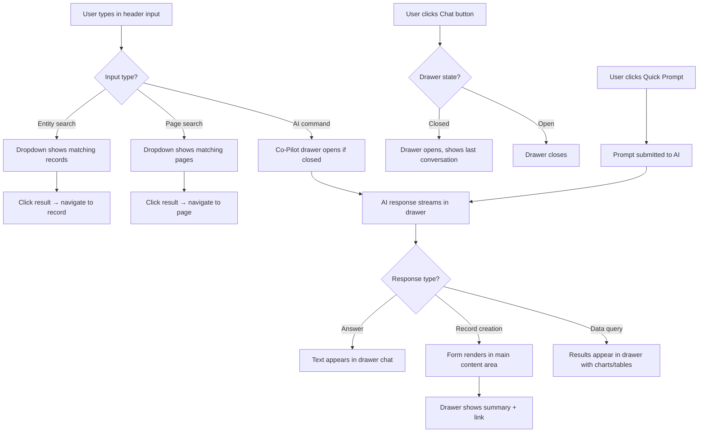

# AI Interaction Model — Co-Pilot Dock

## Overview

The AI interaction in Nexa consists of two connected elements:

1. **Header Bar** — A unified Search & AI input ("Ask Nexa anything...") + a Chat button to open the Co-Pilot drawer
2. **Co-Pilot Drawer** — A collapsible right-side panel that provides the full AI conversation experience, chat history, and preset prompts

These two elements work together: the header bar is the quick entry point (type a command, get a result), and the Co-Pilot drawer is the full experience (multi-turn conversations, history, presets).

## Header Bar: Unified Search & AI Input

```
┌──────────────────────────────────────────────────────────────────────┐
│ [≡ Logo]   [🔍 Search or Ask Nexa anything...          ]  [💬] [🔔] [👤] │
└──────────────────────────────────────────────────────────────────────┘
```

The header bar contains a **single unified input** that handles both search and AI commands:

| Input Type | Detection | Behaviour |
|-----------|-----------|-----------|
| **Entity search** | Starts with known entity patterns (INV-, PO-, SO-) or short keywords | Instant search results dropdown — navigate directly to record |
| **Navigation search** | Module or page names ("invoices", "settings", "CRM") | Navigate to page — fuzzy matching |
| **AI command** | Natural language intent ("create invoice for Acme", "show overdue debtors") | Opens Co-Pilot drawer with AI response streaming |
| **AI question** | Question form ("what's our revenue this month?", "who owes us the most?") | Opens Co-Pilot drawer with AI answer |

**Behaviour:**
- **Keyboard shortcut:** Cmd+K (Mac) / Ctrl+K (Windows) focuses the input from anywhere
- **Placeholder text:** "Search or Ask Nexa anything..." — rotates example prompts on focus: "Try: 'Invoice Acme for March widgets'" → "Try: 'Show overdue invoices'" → "Try: 'What's my revenue this month?'"
- **Autocomplete dropdown:** As user types, shows matching entities (top), pages (middle), and suggested AI prompts (bottom) — similar to Linear/Raycast command palette
- **On AI command:** Input submits, Co-Pilot drawer opens (if closed), AI response streams in the drawer
- **On search result click:** Navigate directly to entity/page, drawer stays closed

## Chat Button & Co-Pilot Drawer Toggle

The **Chat button** `[💬]` sits next to the search input in the header. It has a dual purpose:

1. **Toggle the Co-Pilot drawer** — click to open/close the right-side panel
2. **Badge indicator** — shows a dot when the AI has a pending suggestion or the last conversation had follow-up actions

## Co-Pilot Drawer

The Co-Pilot is a **collapsible right-side drawer** (not a fixed sidebar). When closed, the main content area uses the full width. When open, the content area shrinks to accommodate the drawer.

```
Drawer Closed:                          Drawer Open:
┌────────┬─────────────────────────┐   ┌────────┬──────────────┬──────────────┐
│        │                         │   │        │              │  Co-Pilot    │
│ Side   │  Full-Width Content     │   │ Side   │  Content     │              │
│ bar    │                         │   │ bar    │  (narrower)  │  [Chat area] │
│        │                         │   │        │              │              │
│        │                         │   │        │              │  [Input]     │
└────────┴─────────────────────────┘   └────────┴──────────────┴──────────────┘
```

**Drawer specifications:**

| Property | Value |
|----------|-------|
| Width | 380px (desktop), 100% overlay (phone), 420px (large desktop) |
| Animation | Slide in from right, 200ms ease-out |
| Collapse | Slide out to right, 150ms ease-in |
| Backdrop | None on desktop (content resizes), semi-transparent overlay on phone/tablet |
| Persistence | Open/closed state persists per user session |
| Resize | Not user-resizable (fixed width) |

**Drawer Layout:**

```
┌──────────────────────────────┐
│ Co-Pilot                [✕]  │
│──────────────────────────────│
│ [Recent Chats ▾] [+ New Chat]│
│──────────────────────────────│
│                              │
│  🤖 Good morning, Mohammed.  │
│  Here's what needs your      │
│  attention today:            │
│                              │
│  📋 3 invoices awaiting      │
│     approval (£12,400)       │
│     [Approve All] [Review]   │
│                              │
│  📊 Revenue ↑12% vs last     │
│     month (£142K → £159K)    │
│                              │
│  ⚠️ 2 POs over approval      │
│     threshold                │
│     [Review POs]             │
│                              │
│──────────────────────────────│
│ Quick Prompts:               │
│ [Create Invoice] [Show       │
│  Overdue] [Run Report]       │
│──────────────────────────────│
│ [Ask Nexa anything...   ] [→]│
└──────────────────────────────┘
```

## Drawer Sections

**1. Header Row**
- Title: "Co-Pilot"
- Close button (✕) — collapses drawer
- Minimise to floating indicator (optional: small purple pill at right edge showing AI is available)

**2. Chat Selector**
- **Recent Chats dropdown:** Shows previous conversations with titles (auto-generated from first message). Click to resume a conversation. Most recent at top.
- **New Chat button:** Starts a fresh conversation. The AI resets context but retains user/tenant awareness.
- Conversations persist server-side (stored in the AI conversation log table from the architecture).

**3. Conversation Area**
- Scrollable chat thread: AI messages (left-aligned, grey background) and user messages (right-aligned, purple background)
- AI messages can contain:
  - Plain text responses
  - Inline action buttons ([Approve All], [Review], [Create Invoice])
  - Embedded data cards (revenue comparison, overdue summary)
  - Links to records (click to navigate, drawer stays open)
  - Confidence-scored field previews (when creating records)
- Streaming responses: AI text appears word-by-word with a typing indicator
- Context awareness: the AI knows which page/record the user is currently viewing and can reference it ("I see you're looking at Invoice INV-0047...")

**4. Quick Prompts**
- Role-based preset prompts displayed as chips/pills below the conversation
- Prompts change based on:
  - **User role:** Sarah (Owner) sees "Daily Briefing", "Revenue Summary", "Cash Flow"; David (Finance) sees "Create Invoice", "Bank Reconciliation", "Month-End Status"
  - **Current page context:** On Invoice List, show "Show Overdue", "Create Invoice", "Export All"; on Customer Detail, show "Invoice This Customer", "Show History", "Credit Check"
  - **Time of day:** Morning prompts emphasise briefing; end-of-day prompts emphasise summaries
- Users can customise their preset prompts in User Preferences (pin/unpin, reorder)
- Tapping a prompt fills the input and immediately submits

**5. Input Area**
- Text input: "Ask Nexa anything..." — same capabilities as the header bar input
- Submit button (→) or Enter key
- Supports multi-line input (Shift+Enter for new line)
- File drop zone: drag a document onto the input to trigger Document Understanding
- Voice input button (microphone icon) — for mobile/tablet use

## Co-Pilot Behaviour Rules

1. **Context follows the user** — When the user navigates to a different page, the Co-Pilot maintains the current conversation but gains awareness of the new page context. The AI can say "I see you've navigated to the Customer List — would you like me to help find a specific customer?"

2. **Actions execute in the main content area** — When the AI creates a record (invoice, PO), the form renders in the main content area with confidence indicators, NOT inside the drawer. The drawer shows a summary: "I've prepared Invoice INV-0048 for Acme Ltd — please review in the main panel."

3. **Drawer doesn't block workflows** — The user can work in the main content area while the drawer is open. Clicking on form fields, navigating tables, and using the action bar all work normally. The drawer is a companion, not a modal.

4. **Smart collapse** — On phone/tablet, the drawer opens as a full-screen overlay (since there's not enough space for side-by-side). A "minimise" button shrinks it to a floating pill at the bottom-right corner, showing the last AI message as a preview.

5. **Cross-session persistence** — Chat history persists across sessions. When a user returns the next day, they can resume yesterday's conversation or start fresh. The AI references previous context: "Yesterday you asked me to prepare the month-end checklist — shall I continue?"

## Header + Drawer Interaction Flow


