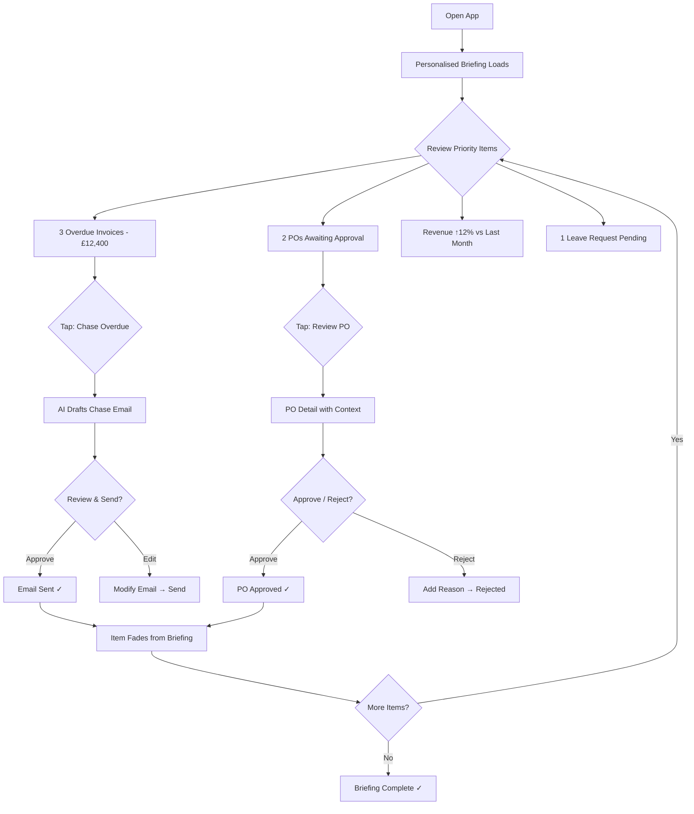
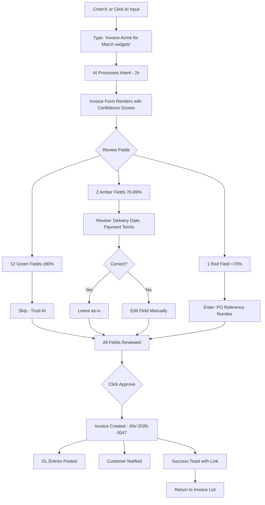
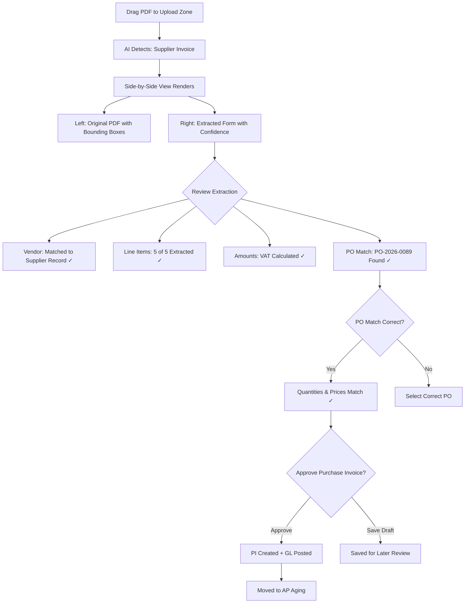
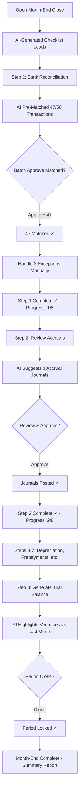
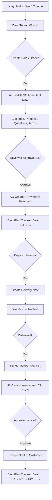
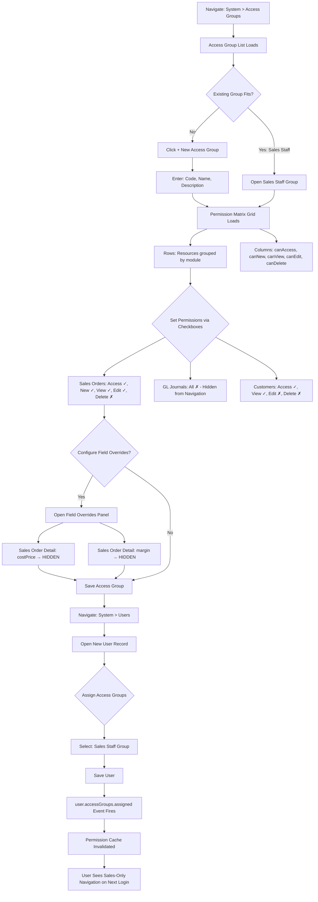

# User Journey Flows

## Journey 1: Morning Briefing (Sarah — Business Owner, Phone)

**Trigger:** Sarah opens Nexa app at 7:15am on her phone during commute.

**Duration target:** 15 minutes for full briefing review (replaces 2-hour desktop session).

## Journey 2: AI Invoice Creation (David — Finance Manager, Desktop)

**Trigger:** David needs to invoice Acme Ltd for March widget delivery.

**Duration target:** <60 seconds from intent to approved invoice.

## Journey 3: Document Upload & Extraction (David — Supplier Invoice)

**Trigger:** David receives a supplier invoice PDF by email.

**Duration target:** <3 minutes from upload to approved PI (replaces 45 min manual entry).

## Journey 4: Month-End Close (David — Finance Manager)

**Trigger:** Last working day of the month; David opens Month-End checklist.

**Duration target:** 1 day (replaces 3-day manual process).

## Journey 5: CRM Pipeline to Invoice (Priya — Sales Manager)

**Trigger:** Priya moves a deal to "Won" in the CRM pipeline.

## Journey 6: Access Group Management (Tom — System Administrator, Desktop)

**Trigger:** Tom needs to set up permissions for a new Sales Clerk user who should create and view sales orders but not delete them, and should not see cost price fields.

**Duration target:** <5 minutes for assigning an existing access group to a user; <15 minutes for creating a new custom access group with field overrides.

**Key UX details:**
- The permission matrix is a grid of checkboxes — admins can scan an entire group's permissions at a glance
- Resources are grouped by module with collapsible sections for efficient browsing
- Pre-built access groups (Sales Staff, Finance Clerk, etc.) are available immediately after company creation from the default data import
- Cloning an existing group is available via the overflow menu, allowing quick creation of variants

## Journey Patterns

**Common patterns across all journeys:**

1. **AI-Prepare-Review-Approve** — Every creation journey follows: express intent → AI prepares → review with confidence indicators → approve. This is the universal pattern.

2. **Progressive Status Tracking** — Each entity created updates the `<EventFlowTracker>` on related entities. Users always see where they are in the cross-module flow.

3. **Batch Processing** — Where multiple items need the same action (approve, match, chase), batch operations are available. Individual exception handling follows.

4. **One-Tap Actions** — Briefing items, notifications, and approval requests all support one-tap action (approve, reject, view, chase) without navigating to a detail page first.

5. **Contextual Creation** — Records are often created from the context of a parent record (Invoice from SO, PI from PO, Journal from checklist), and the AI uses that context to pre-fill with higher confidence.

## Flow Optimisation Principles

1. **Zero-Navigation Principle** — If an action can be completed without leaving the current view, it should be. Inline approval, inline status change, inline chase email.

2. **Progressive Commitment** — Start with the simplest action (one-tap approve), escalate only when needed (edit a field, add a note, reject with reason). Don't front-load complexity.

3. **Context Preservation** — After completing an action, return the user to their previous context. Don't dump them on a generic home screen. If they were in the briefing, return to the briefing. If they were in a list, return to the list with the updated item.

4. **Error Prevention over Error Handling** — AI confidence scoring, inline validation, and smart defaults prevent errors before they happen. When errors do occur, the fix is inline (not a separate error page) with a suggested resolution.
